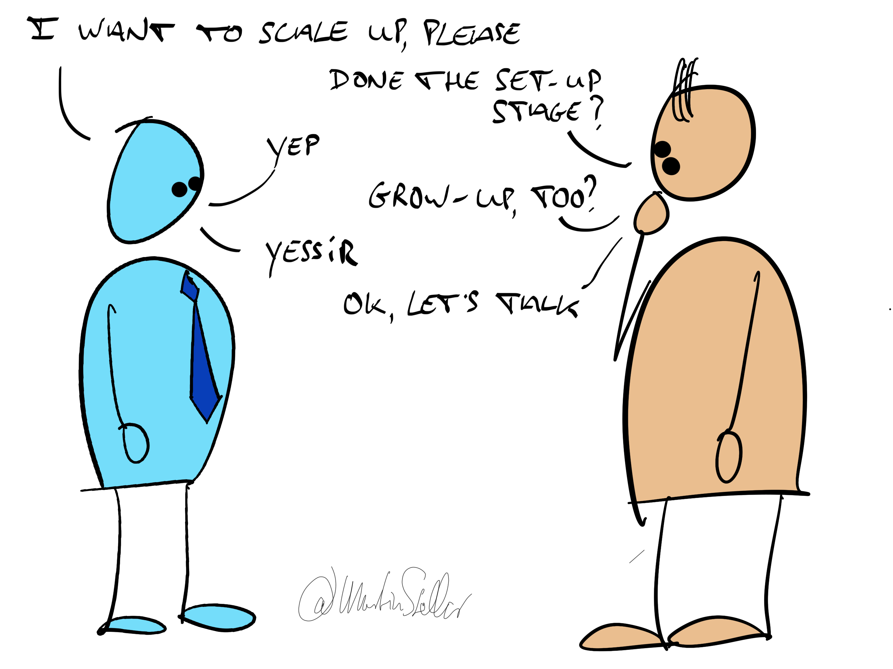

>[[🏋️ Trainings|Trainings]] >> [[👨‍🎓 Mini-training - Introduction to Stages & Ingredients of Business Growth (SIBG) Pt. 0.0|Stages and Ingredients of Business Growth]] >> 3.0 The Scale Up Stage

Scaling up... it's where businesses go to die... or instead grow dramatically in terms of impact, revenue, and profits.

So now that we've looked at the Set Up and Grow Up stages of business, let's tackle scaling up, and make sure we don't break things along the way.

Because you've got to be careful:

Scaling up a business can easily go wrong and cause massive and abject failure: you've got to get it right and proceed with care and great deliberation.

So what does 'scaling up' actually mean?

### Scaling up means you go from good to great

From ticking over nicely, to profit and revenue numbers that constantly increase.

From "This machine runs itself to" "Let's strap a turbo on it!".

And for that kind of effect to take place, you fundamentally have three ways to scale up:

**[[🧑‍🎓 SIBG Pt. 3.1 - Expand into new products and services|1: Expand: Introduce new products and services]]**

Here, scaling up means working with past and current clients, and generating revenue from them by serving in new, additional, or complementary ways.

It's a fantastic way to increase client loyalty as well as revenue, and:

If you add in cross-selling and 3rd party providers, you can make a killing just on referral payments, aside from what your new offers bring in.

**[[👨‍🎓 SIBG Pt. 3.2 - Expand by leveraging connections & relational capital|2: Go vertical: open new marketing & sales channels]]**

How many ways are there, to catch a fish?

If you've built a reliable lead generation strategy using direct outreach, you can try and automate part of the process by running ads.

Or if you've been landing clients by generating buzz on social media, you can add in content marketing, and add a publishing arm to your business.

(A fantastic idea for authority positioning and thought-leadership, btw).

Or, if your marketing and sales are working, and you have excess capacity:

You can create revenue partnerships, where others bring you leads and referrals, and you pay a commission.

**3: Go horizontal & enter new markets

This is usually the most tricky one to get right, because a new market means a whole new world of customer profiles to get familiar with.

To do that right, you actually need to go back to [[👨‍🎓 SIBG Pt. 1.0 - The Set Up Stage|Stage 1: Set Up]].

Don't **ever** make the costly mistake of thinking that a new market can be opened with the messaging and positioning that works for your primary market.

But, when done right, the success you have with your primary demographic can be a great jumping-off point for accessing and converting new demographics.

By leveraging the endorsements and relationships you have with your existing audience and buyers, you enable your new audience to generate the trust they need in order to buy, based on the great testimonials and case studies you have from your primary market.

But first, let's look how to scale up without stress and with minimal risk:

**[[🧑‍🎓 SIBG Pt. 3.1 - Expand into new products and services|Expand into new products and services]]**

 
