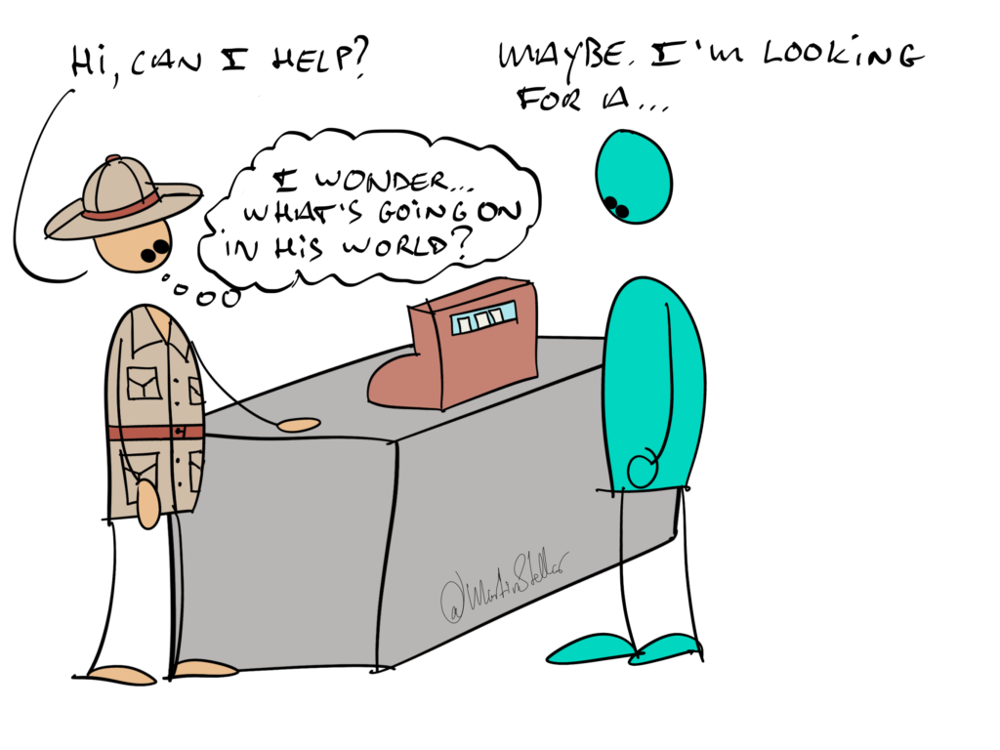

Isn’t it frustrating, when you see a solution for someone, and they just will not buy into it?

But it’s so clear to you! You KNOW that things will change for them, and for the better!

Then how come they don’t enroll?

Don’t they SEE? It’s so clear!

Yep, it’s clear: to you.

And nope, they don’t see it.

Why?

This might sound harsh or unjust, but in the end, it comes down to the cold reality called 'self-importance.'

When you find yourself failing to create a client, or someone refuses to help or collaborate, or rejects your sound reasoning and good ideas, it’s because you’re approaching the situation from a self-oriented point of view.

The POV is **your** POV, you're making that POV superior to theirs. You're trying to get them to see things your way, you're making your view on the situation more important than theirs. 

And while you might have the correct vision on what they need, **they** will only see that vision, and buy into it, when they decide to explore that vision of yours.

And as long as your point of origin is your conviction that you’ve got it right and they need to change or adjust their POV, you won’t enroll them - not as a buyer nor a collaborator or anything. 

Instead, put yourself in their shoes.

Apply and [[📄 How I deploy 'strategic empathy'|deploy strategic empathy.]]

Be a researcher, an anthropologist, an explorer, asking yourself incessantly "What’s going on in that mind, in their world?"

What fears, aspirations, desires are present for them?

**What would it be like, to be them?**

Do that, and you [[📄 How to make selling easier by looking at your buyer's perspective|make the enrollment process about them]] and their vision, instead of about your vision.

That way, people will be far more open to trying out your point of view, and you’ll find yourself enrolling people with much more ease.
