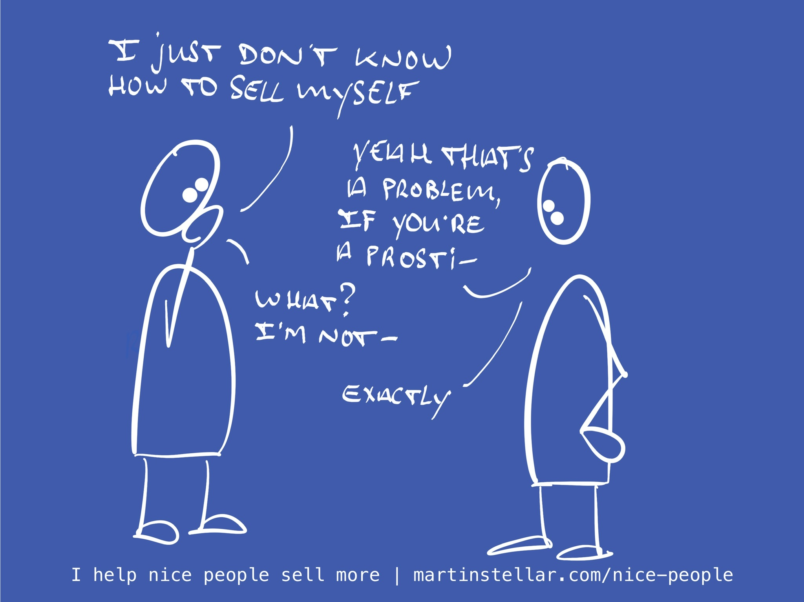

It’s one of the things I hear most often: "I just don't know how to sell myself."

You might feel that way too, but:

Is it true?

Consider:

Each time you interact with someone and you’re trying to get a result with them, you’re selling.

You’re selling them an idea, you’re selling them on collaborating, on showing up, on what you believe to be the best outcome.

There really isn’t any situation where you’re not, in some way or other, selling someone on something.

Even when you’re having a chat with a friend and you’re just shooting the breeze: you’re selling them on engaging with you.

And if what you’re saying isn’t interesting or relevant to them, they’ll disconnect: No sale.

They’ll only ‘buy’ what you’re ‘selling’, as long as it’s interesting for them. In other words, whatever you say needs to be relevant, or they won't 'pay' attention to you.

Another thing I hear a lot is:

“I just don’t like selling! It’s awkward and uncomfortable.”

I get that, but really that’s just because of a mistaken view on what selling actually is.

It's because you see selling as "that thing that people do when they phone you up to offer you a ‘terrific deal’ on switching phone providers".

But that’s not selling: that’s simply hassling people.

Selling - when done by nice people, who care about others - is just a way of having a conversation intended to find common ground, to see where your ideas overlap, and trying to figure out in what way you would both like to move forward together.

Nothing awkward about that, right?

“I can’t get the rates I want!”, is another common one.

If that’s the case, it’s usually because you’re focused on the wrong thing.

Meaning: you’re trying to have the other see [[📄 How to Make a Buyer Wrong, and Lose the Sale|how worthwhile your offer is]], instead of trying to figure out how much it’s *worth to them* to solve whatever problem your work solves.

In other words:

You’re making it about what you think, and offer, and provide, instead of trying to get on their side, and seeing what wants and aspirations they have, and which fears and frustrations.

Or this one:

“So many people who would really benefit and ought to buy my thing, end up saying no!”

If that’s the case, the same thing applies:

You’re making it about yourself, not them.

So then, what’s the remedy for these issues?

Two options:

1. Read everything there is in [SalesFlow Coach](https://SalesFlowCoach.app), and pay very close attention to [these emails](https://martinstellar.com/nice-people) as they come in daily.
2. Or, if you're ready to invest in your ability to sell more, [send me an email](mailto:personal@salesflowcoach.app) to set up a chat, and if we're the right match, I'll help you improve your [[📄 Mindset, Method, Skillset|mindset, your methods and your skillset]].