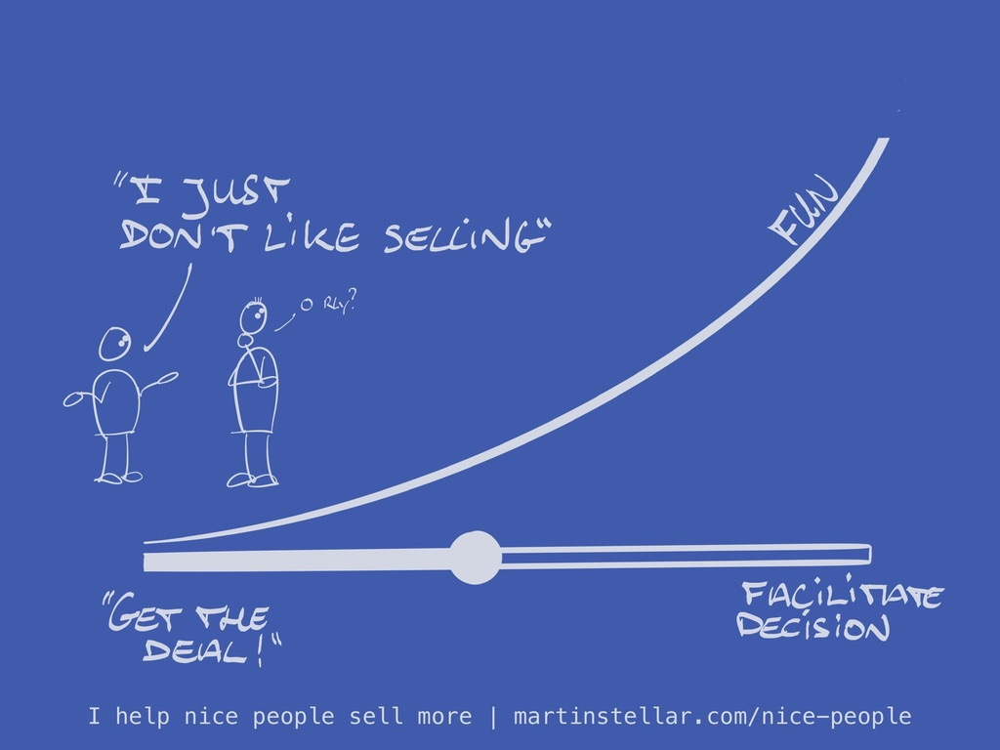

If the idea of selling is difficult or uncomfortable for you in any way, remember this:

People love to buy, but loathe being sold to. You know this from experience, because we've all forked over money for things, and then we ended up really pleased that we parted with the money and acquired the thing.

And that means that if you don't like selling, the only thing you need to do - aside from seeking to [[📄 "I wish I didn't have to sell my work...!"|have conversations]] - is: making it easy to buy.

And, you do that by simply helping a buyer get clarity, in function of them making a yes/no decision. And helping people get to a decision is nice, it's helpful, and hey yes: it can even be fun. And yes, if you do it right, a lot of people will end up deciding 'yes'.

And once you get that - once you understand how to make it easy for people to buy - all your struggle in selling your work will change, and the struggle might even disappear.

Like it did for a recent student of my Sales for Nice People training:

"I was telling myself a false story about me as a professional. I convinced myself that I was good at service, good at advice, but rubbish at sales. Worse than that, I believed that effective selling was an affront to my values and in direct contradiction to my personality. I couldn’t sell without selling my soul.

"Martin has changed all that. What I perceived to be weaknesses in a sales context - preferring to listen rather than talk, a service mentality, a long term perspective - turn out to be strengths for ethical selling. Ethical selling is about stewardship. Done well, it’s another opportunity to provide great client service.

"Martin’s coaching has changed my story. I now have a platform for enjoyable, mutually beneficial conversations with potential clients. The way to get better at selling is to become more skilled at being bought."

~ Phil Adams, I Know Some People Ltd.

Gotta love it when a client really gets it!

Anyway: I’ll bet that you have something for sale that truly makes a difference in your buyer’s life.

And obviously you want to have people buy that product or service you have.

But, you do want to stay in alignment with your values, right?

You don’t want to coerce, or be pushy, or manipulative - because hey, you want to sleep at night, knowing that your values, your integrity, and your ethics have not been compromised.

If any of that rings true, we have a lot in common.

And as an ex-monk, ethics and integrity matter rather a lot to me, just like I imagine they do to you, even if you never spent time in a monastery.

But those values are exactly why I never ‘sell to people’.

Instead, I just have a conversation. I ask questions, pay attention, tune in to what’s going on in the other person’s world.

And, most importantly, I let people make up their own mind, on whether or not to buy from me.

The result? Fantastic conversations that people are happy with whether or not they buy, and enormously engaged and happy customers, when they buy, just like Phil.

So what’s my secret?

Ain’t no secret.

Other than: I show up to serve, and I'll bet that's how you operate as well, even if you don't necessarily think in those terms. You've just been taught that 'selling means' making people do your bidding, but nothing could be further from the truth.

Selling, at least in Sales for Nice People, just means that I help people get the clarity they need on making the best possible decision for themselves, at this point in time.

And if that decision is a ‘no thanks, not today’, I don’t fret.

Whenever that happens, I know I’ve stayed true to my moral compass, and I’ve helped someone choose what’s right for them.

You can do the same thing, once you realise that 'selling' - or enrolling - is nothing more than facilitating a decision-making process, which in itself is an act of service.

It's fun.
