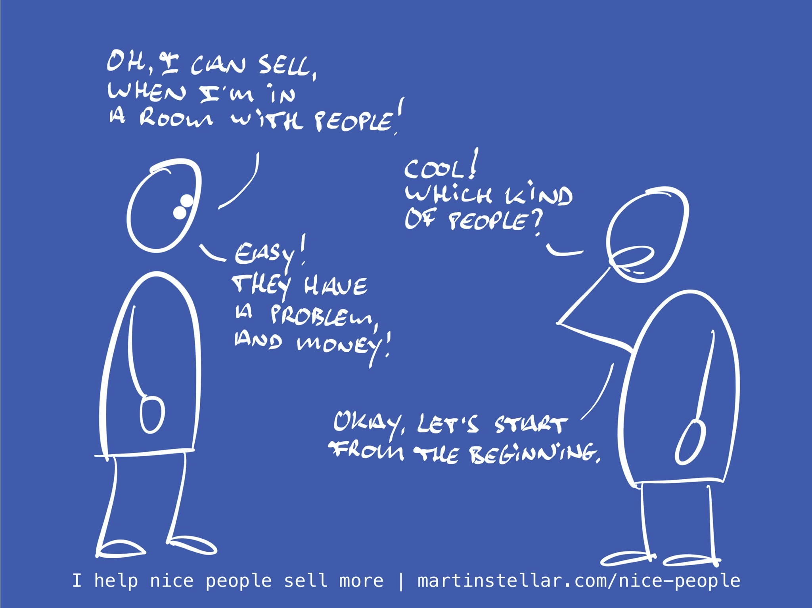

---
tags:
  - Articles
  - Assets
  - HSA
  - Leverage
pubDate: 2024-08-02
type: landing
location: 
cdate: 2024-08-02 Fri
episode: 
imagePath: Media/SalesFlowCoach.app_The-fundamentals-of-finding-strangers-and-turning-them-into-clients_MartinStellar.jpeg
podStatus: Published
---

Yesterday someone told me: "Once I'm in the room, I usually don't have too much trouble landing a sale", and yes, that makes sense. I used to say that too. Maybe you as well?

Problem is, "selling" doesn't just happen once you're in the room. If it were that easy, we'd all be getting into rooms with people, and creating clients, just like that.

No, selling starts way before you have the meeting, which begs the question: how actually do you get into the room?

How do you get visible to strangers, connect with them, and get that meeting that allows you to sell?

If you look around the internet, the obvious and most frequent answer would appear to be 'Use AI-enabled automation and message 5000 people per week to get meetings on autopilot!'.

Uhuh, right. Burn dinosaurs bones, so that you can spam thousands of people at a time, and land your 10 meetings. Woo-hoo.

Maybe that stuff works, but spamming isn't part of the Sales for Nice People methodology, and besides:

Even if it does work, how do you know you're getting meetings with the right people? Sucks to be on calls with unqualified leads, and that's easily what you get when you go for volume, shooting in the dark.

Instead, why not start by getting clear, and specific, about exactly who should be in a meeting with you, and for what reason they would want to?

Why not establish the fundamental elements of how to find strangers and turn them into customers?

In other words: doesn't it make more sense to first know, with precision, why people should choose you and not someone else, and who those people are, and what hyper-specific set of problems they want solved and solved now, and how to communicate your message to them?

Succinctly: your USP, Avatar, their Problem-stack, and your Messaging.

If you don't know exactly what those are, you can send as many broadcasts you want, and even get meetings, but you'll ultimately find it hard to convert people. Even when you get into the room with them, because you'll be in the room with far too many people who aren't the right fit.

No, if you want to be smart about your work and you want your sales process to be efficient (and fun), then you take those four assets (USP, Avatar, Problem-stack, Messaging), and you leverage them, by creating precise definitions.

And how do you do that, how do you create those definitions, and make it easier to get into conversations with buyers, and the right ones at that?

Well, a good place to start is to spend 60 minutes with yours truly, and do a fast, deep-dive analysis on those four sales assets. One session, leverage that can make this your best year yet.

Get yourself an HSA Breakthrough Session, so you can stop the inefficiency, get into more rooms with buyers, [and create more clients.](https://martinstellar.com/salesbreakthroughsession/)