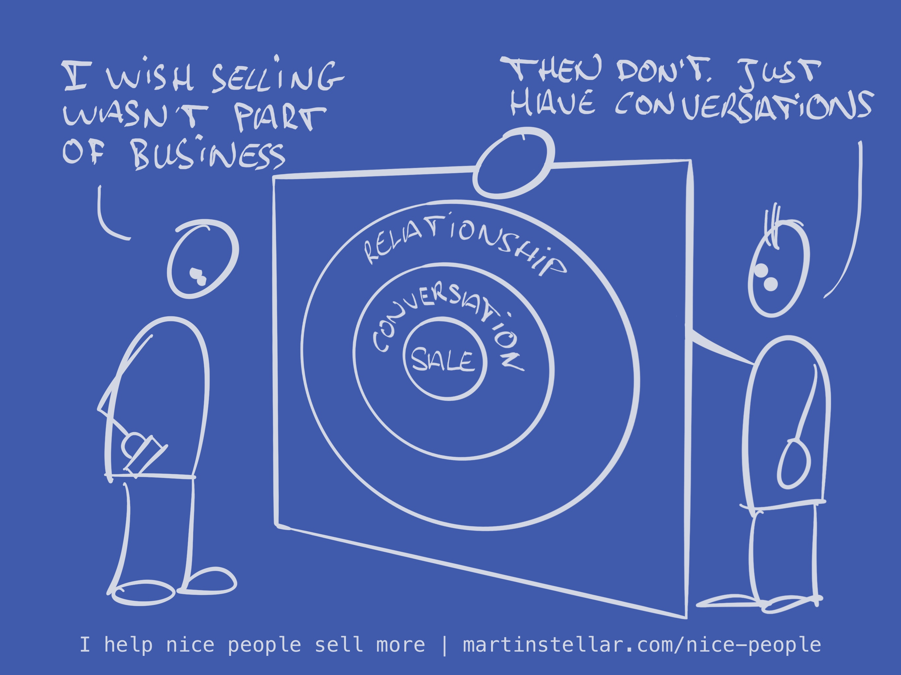

“I wish selling my work wasn’t part of being in business...”

You wouldn't believe the number of times I’ve heard that…

But the reality is that if you want a buyer, selling is not optional - it’s just part of business.

The good news is?

Things are bought, not sold.

When a buyer says yes, and signs or pays, that’s *them* making the decision.

That's someone else buying - not you selling.

So you as the seller, you don’t need to do any ‘selling’ the way you normally think of it.

Instead, your only job is to have a conversation - one that makes it easier for the buyer to decide yes, or no.

Because a sale happens in the context of a conversation, and that conversation happens in the context of a relationship.

And you're able to have conversations and create relationships, right?

Well then… that’s all you need to do. Have conversations.

But, there’s different kinds of conversation:

Those that meander, that don’t lead to an outcome or sale, that leave you tired and frustrated with yet another deal that went nowhere...

And then, there’s [[📄 Agendas and framing - How to start a sales conversation|the kind of conversation that has a purpose]], that clears things up as to whether or not a buyer wants your thing…

… and, that's the kind of conversation that elegantly leads to a buyer making a decision, without any pressure or manipulation.

So when engaging with a buyer, make your goal is to [[📄 The Shift in serving customers even before they buy|help them get to the clarity they need, to make a decision]].

That's how you help people buy, no 'selling' required.
