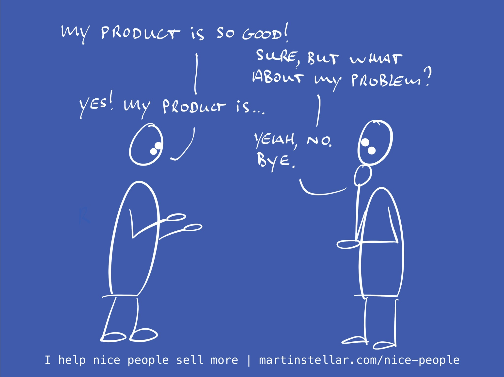

---
tags:
  - Articles
  - LoveTheProblem
  - SalesConversations
pubDate: 2024-11-20
type: sfcContent
location: 
cdate: 2024-11-20 Wed
episode: 
imagePath: Media/SalesFlowCoach.app_Be-in-love-with-the-problem-not-your-product_MartinStellar.jpeg
---

Behold, the dangers of listening to people in the LinkedIn comments:

"Loving your product makes selling effortless".

It's a nice opinion, but it's completely wrong.

For one thing, I don't think there's anything that makes selling 'effortless'. You're going to have to find people, engage with them, converse with them, make proposals, and then figure out how to get a deal over the line.

Sounds like effort to me.

Which doesn't mean it has to be a struggle... but effortless? No. Which, if you're in business and you sell things, you'll have noticed.

And, the opinion this person posted starts from the wrong point of origin, if you want to sell things.

If you want selling to be easier, the last thing you want is to be in love with your product.

Because when you're in love with your product, you'll end up yakking on about how great it is, you'll be endlessly spewing me-messaging, and your buyer is going to sit their with their eyes glazed over, wondering when it'll end.

So the trick is to not focus on your product, but on the problem it solves.

Sure, be in love with your product if you want, but always make sure that before anything, you're *in love with the problem* your buyer has.

If you're in love with your product, your messaging is going to be about you and what you do, and frankly, nobody cares.

What buyers *do* care about, is the problem they need solving, and the answer to the question: "Are you the person I want to select, to help me solve it?"

Even then, selling won't be effortless. But it sure won't be as hard, annoying and frustrating, as it is if you're obsessed with your own product.

Selling isn't about you, or your solution or product - it's always, and only, about your buyer and their problems. So, be in love with those problems. That's how selling becomes more fun a less effortful.

And to make selling even less effortful, and even fun, turn the process into an act of service. 

Sales for Nice People [will teach you how](https://martinstellar.com/sales-for-nice-people-info/). 
