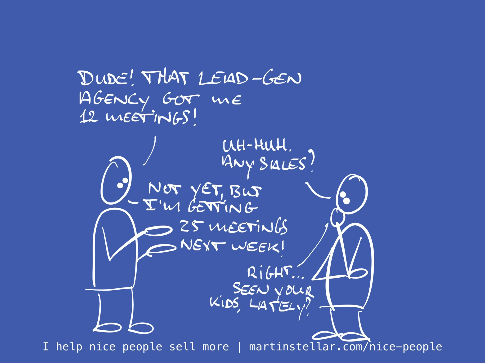

---
tags:
  - Articles
  - Hidden-Sales-Assets
  - LeadGeneration
pubDate: 2024-08-22
type: sfcContent
location: 
cdate: 2024-08-22 Thu
episode: "39"
imagePath: Media/SalesFlowCoach.app_Automated-lead-gen-because-everyone-should-send-better-spam_MartinStellar.jpeg
---

"Hey Martin, should I use automated lead gen campaigns?"

My eyes narrowed, as I said: "Definitely. We should all send better quality spam in larger volumes".

Cynical? You bet.

Inline with values and the Sales for Nice People ethos? Absolutely.

Because sure, you can automate your lead gen, and spam thousands of people at the click of a button, but it's not very nice, is it?

Instead of spamming and interrupting 100s of people a day, you're now going to do it to thousands of people per day?

Look, we all want more leads and more sales, and it's not necessarily that there's anything wrong with automation or large-scale campaigns, but:

Is there anything *right* with it?

To me, it's just an exponent of playing a numbers game. Same game, just bigger numbers.

And while selling includes a numbers game, ultimately it's a people-game.

Define the ideal buyer, create the messaging they respond to, propose a deal that they want and they'll enroll themselves.

And I don't know if playing the game with higher numbers will get you all that more in terms of sales. In fact I don't think it does.

For one thing, because everyone and their sales rep does it, we're all getting bombarded by inane and badly targeted spam, so everyone automating is just training leads on how to ignore sellers.

But also: if automated outreach really were that profitable, wouldn't there be droves of companies that suddenly get hockey-stick growth because of it?
And wouldn't lead-gen agencies not suddenly become industry-leading unicorns, because what they sell makes their clients so much more money?

From what I can tell, neither of those things occur at any higher rate than before AI and lead-gen became mainstream.

So no, I'm not a fan of automated lead-gen-at-scale-with-unlimited-appointments-booked-into-your-calendar.

Especially not when it's 'results-based!' and the lead gen agency only gets paid when you land a client. Because in that scenario, the agency cannibalises your time in meetings in order to calibrate their own precision, so you might not be paying in money, but you'll surely be paying in time.

So what to do instead?

First, you get yourself a Sales Breakthrough Session, so you'll know exactly what to say, and to whom.

And to find those people to say it to, you Mine Your Network for Opportunities.

Hit reply and I'll send you the link to the latter.

And to get the former, hit this link: https://martinstellar.com/salesbreakthroughsession/
