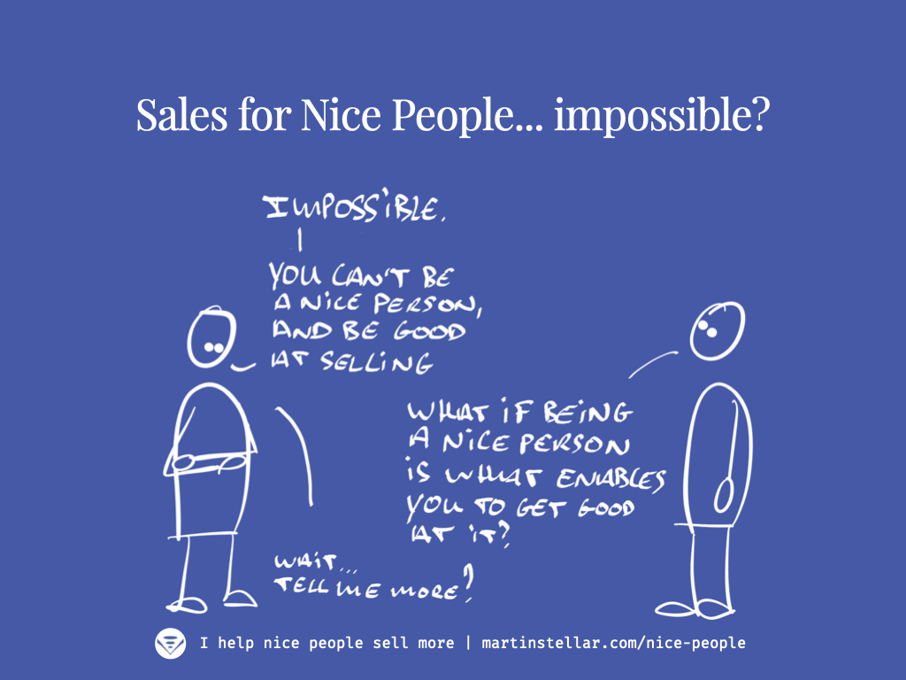

---
tags:
  - Articles
  - SFNP
pubDate: 2024-07-18
type: sfcContent
location: 
cdate: 2024-07-17 Wed
episode: "14"
imagePath: Media/SalesFlowCoach.app_But-a-nice-person-can-never-be-good-at-selling_MartinStellar.png
podStatus: Published
---

Ah, the identity-piece.

That thing where people don't buy, because doing so would mean they have to become someone they don't want to be.

For instance, suppose you're a consultant, and you're offering your buyer a programme where you manage and implement change for them... but that buyer happens to be a highly independent, self-made individual, proud of doing things under their own steam...

That buyer isn't ever going to buy your programme, because for them do so would mean they have to become 'someone who no longer is in control, and who is no longer the sole responsible party for change and results'.

That's an identity that that kind of buyer doesn't want, and there you go: no sale.

And yesterday, a former-SFNP-student-now-friend asked me about Sales for Nice People, and whether being a 'nice person' might be what prevents you from wanting to learn the system. "Are you not selling nice people the wrong identity, if you offer them to learn how to sell?

A terrific question, because yes:

If your identity is "Nice person", then there could be a buy-blocker.

Because for many people, the definition of 'Nice person' includes the premise 'It's impossible for nice people to be good at selling'.

Logic then says "I am a nice person, therefore I'll never be able to be good at selling, therefore even Martin's training won't help".

And if that's the case, that would suck for so many reasons.

For my wallet, obviously, because my wallet likes it when people buy from me /FullDisclosureInCaseYouNeededIt.

But more importantly, it would suck for you, because that would mean you don't get to improve your selling, and that means your wallet won't get what it deserves to either, and more importantly:

The people who really, truly, ought to get your work, who would benefit from the impact and change that you create...

They won't get any of that, because you weren't able to get them to buy from you.

As you can see, it's suckiness all around. That's the bad news.

The good news?

It's perfectly possible for a nice person to sell more, provided you get this one fundamental concept:

### Your values are why you deserve to sell more

Because your values make for quality work. They are what keeps you in integrity, fair, dealing ethically with your buyers.

And because of those values, not only do you deserve to sell more:

The are also the very driver of an ethical, integrity-based sales process.

Which means your integrity stays intact, and so does your identity: you'll be able to sell more, without having to become someone you don't want to be.

Because your values are what makes you the better choice, and once you internalise the SFNP system and the different modes of conversation in it, you'll be able to:

- Sell with confidence and without any awkwardness
- Confidently ask for the money
- Get paid what your work is worth
- Have sales conversations that your buyers enjoy and will want more of (i.e. less ghosting)
- Have conversations where your buyers enroll themselves, no persuading or convincing required
- Land more buyers, faster and at better prices

And these claims are backed up by actual results. It's not for nothing that my business partner Mairi Mickel says:
"I fully endorse Martin’s sales programme for anyone serious about investing in winning more clients."
So yeah, there's an investment to make in order to get the training, but let me ask you:
Given that you get 10 weeks of 1 on 1 training, plus ongoing text-based support daily, AND you get weekly coaching on the deals in your pipeline...
Is that worth an investment of $1490, one-off for the ten weeks?
If yes, [here's where you can enroll in the programme today](https://martinstellar.com/sales-for-nice-people-info/).
If not, do me a favour, hit reply, and tell me what in this offer is missing for you?

Oh, and there's more good news:

For a limited time, I'm including a bonus:

If you purchase the training before Monday, July 22nd, I'll give you a no-cost HSA Breakthrough Session, (normally $350), where we'll analyse your Hidden Sales Assets, and develop targeting and messaging that make it easier to identify and attract buyers, which will be a super helpful way for you to get a return on your investment.

It's a good offer. [Don't miss it.](https://martinstellar.com/sales-for-nice-people-info/)
