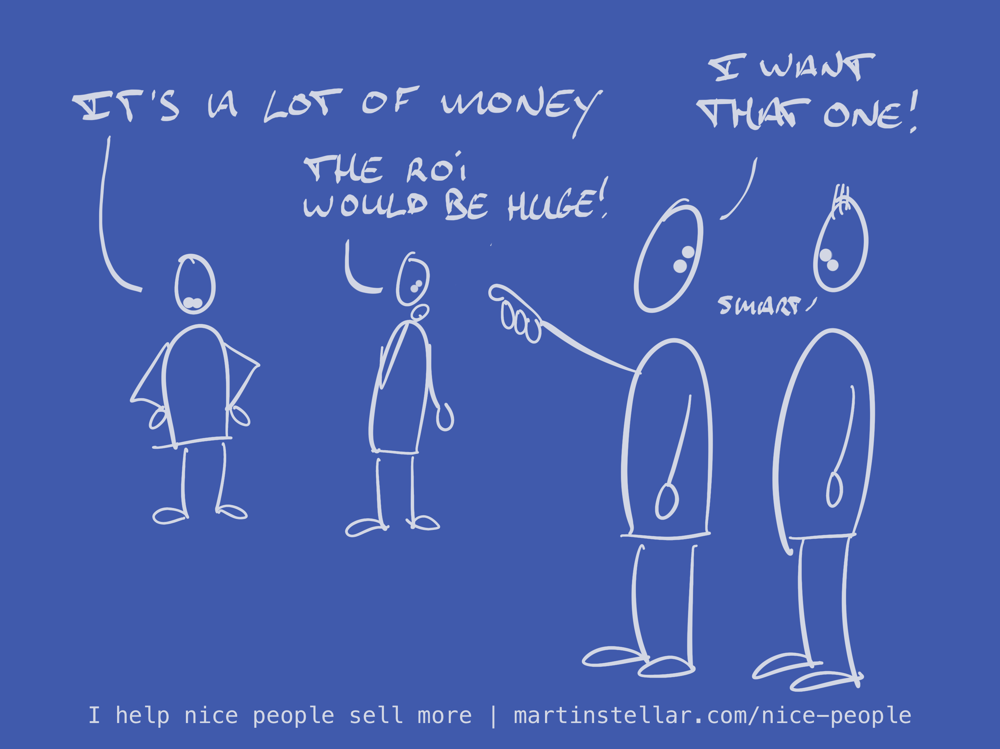

---
tags:
  - Articles
  - Pricing
  - Targeting
pubDate: 2024-11-06
type: sfcContent
location: 
cdate: 2024-11-06 Wed
episode: 
---

And you are right: 'people' won't pay the kind of money that your work is worth.

The question is: who are those people?

Next up: [[📄 Buyers That You Should Avoid Like the Plague|how about you radically ignore all of them]]?

Good, now you're left with a smaller set of candidates, of the kind who might actually value your work, and are willing to pay good money for it.

What's that you say? Those people don't exist?

Well, you might want to rethink that. What people are willing to pay for is entirely subjective.

For example, I can drive out to Marbella, spend some time at a beach club, and within a few hours I'll see someone order bottles of champagne at 1000 Euros each, and instead of drinking the stuff, they spray each other with it on the beach.

To that kind of person, that kind of purchase is worth it. What fun. (Also: if you're that kind of person, don't bother getting in touch).

The point is, each person makes their own assessment of what constitutes 'value', and what kind of money they're willing to pay for it.

Back in my tailoring days, some people would balk at a 2000 Euro price tag for a two-piece, and others wouldn't even consider buying one because at such a low price, it can't be all that good.

It's all in the buyer's mind, so it's your job as a seller and provider of high quality coaching and consulting to select those who do value your work, and to ignore those who don't.

Because I promise, they're out there. But you'll never find them if you keep trying to sell to people who don't have the money or who have it but don't want to spend it.

Obviously that does mean you need to know how to identify them, and you also need to know how to engage with them and have them appreciate the value you deliver.

And if you want help with that, I'm here for you.

Feel free to [schedule 20 minutes](https://calendly.com/martinstellar/20min) in my calendar for a friendly chat, and then we'll see what next steps to take.