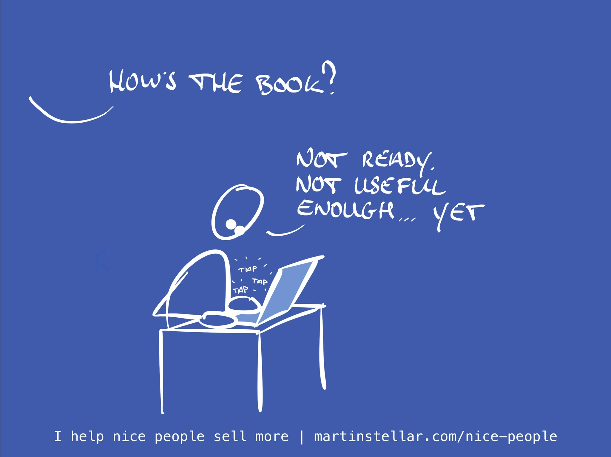

It's nice to have big plans and a compelling ambition. And given all the content I've written over the years, the idea of writing and publishing a book in less than a week was... well, ambitious, but not impossible.

Except when life gets in the way. This weekend my godson and his parents arrived, so that took a big chunk out of my time.

And a friend called asking if I could take her to the hospital, so there went another bunch of hours (It wasn't anything serious, she's home and she's fine).

Of course none of that would have been an impediment to releasing the Sales for Nice People book today, if only I hadn't wasted a bunch of time on Thursday and Friday, trying to figure out how to export Markdown to ePub, instead of hammering the keyboard and getting the manuscript ready.

What can I say? My inner nerd needed feeding 🤷

But there's an upside to it all:

Exactly because of the delay, and because of some feedback I received over the weekend, I realised that the form and shape I had in mind for the book was good... but incomplete.

This due to reading Rob Fitzpatrick's excellent Write Useful Books, which had me see that for this book to actually be relevant, applicable, and *useful*, it's going to require something more than just the stories and the SFNP teaching sections.

No, for my book to actually help, and be properly useful, it needs to include some bonus content in the form of question-sets and decision trees that you can print out and use immediately, and those are what I'm working on at the moment.

So I don't mind that it won't get released today, and given all that will be included once we go live, I hope you don't mind either.

If you want to hear the inside story and get yourself a free copy, you can [join the launch list here.](https://martinstellar.com/book) Perks await.

Cheers,

Martin

P.s. The 16-week Sales for Nice People 1 on 1 training is available for anyone ready to get weekly personal sessions that include deal coaching. But the price (currently $2090) for the programme is going up by $100 per day, so if you want the programme before tomorrow's increase, [here's where you can get it.](https://martinstellar.com/sales-for-nice-people-info/)
