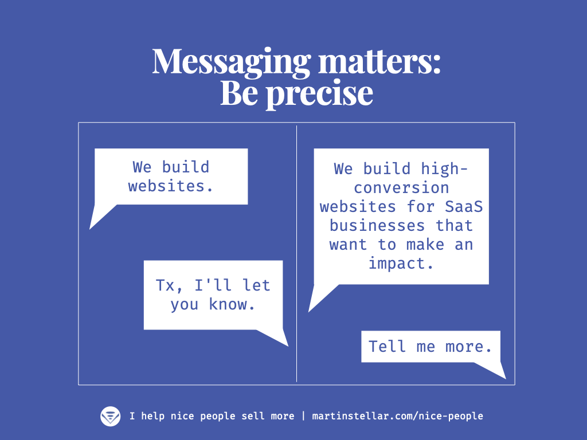

---
tags:
  - Articles
  - Hidden-Sales-Assets
  - Messaging
pubDate: 2024-08-09
type: sfcContent
location: 
cdate: 2024-08-09 Fri
episode: "30"
imagePath: Media/SalesFlowCoach.app_Messaging-matters-for-selling-more-be-precise_MartinStellar.png
podStatus: Published
docStatus: Slated
---

 

"Bread, $3 per loaf" might get you buyers if you put it on a sign outside your bakery.

But the bakery next door that advertises "Vegan sourdough, $3 per loaf" will sell a lot more.

Why?

Because the second message is precise. It's specific, it says what's in the tin.

And, it includes an identity-statement: it's for vegans. It enables people to self-identify as a buyer.

Most business owners are afraid to get so specific, because "If we state that we're for these kinds of people, everybody else will ignore us".

And if that were to actually be the case, and everyone else would ignore you, you'd strike very very lucky indeed.

Because in that case, you'd sell a lot of your vegan sourdough - but if instead you sell a generic kind of bread, for everyone who likes bread or is hungry, far fewer people would want to buy from you... and a lot of people would go for the sourdough instead.

Not because more people become vegans or fans of sourdough, but because it's specific, and therefore buyers assume it must be special, and better. Even non-vegans will want to try it.

So, if you want to sell more of your work, whether that's bread or routers or consulting or SaaS subscriptions:

Get as specific and precise as you can with your messaging, be as narrowly defined as you can be, on what problems you solve, for which kind of people, and give them a reason to self-identify as your buyer.

It'll get you more leads, and more of those will become buyers.

