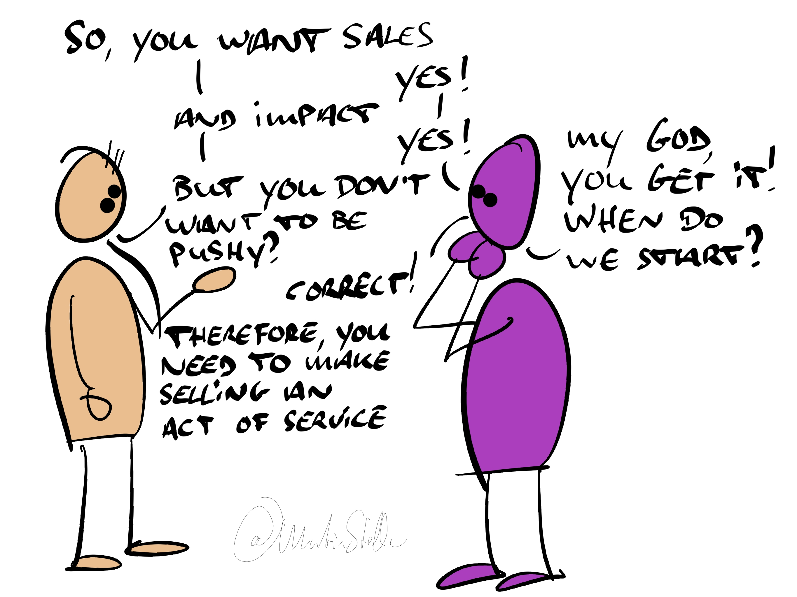

One of the most powerful moves you can make in a sales conversation, is rephrasing and summarising what your buyer says.

Coaches  and therapists do this all the time:

"So what I'm hearing you say, is xyz. Did I get that right?"

It works extremely well, because it helps your buyer focus on the summary of their problem, instead of being mired in the messy complexity or overwhelm of it all.

And, it's effective because when you can articulate another person's problem better then they can, they automatically assume you have the solution. Which you probably do, if you *get them* that well.

And that “They get me!” is what makes a buyer want to know more about working with you, or makes them want to buy from you.

But how do you do that, how do you get there?

How do you actually create that message, that summary, on the fly, in a conversation?

It can be real simple, if you use the ABT framework:

And, But, Therefore.

The framework actually comes from the makers of South Park - they've been using it for years to create their stories and episodes.

And in my case, this would be an example of how I'd use it:

“I work with leaders, coaches and consultants, who are on a mission to do something positive with their work - they have a mission or a purpose that drives them, and there's meaning behind their work.

“And, they have a high degree of values and integrity.

“But, that means that very often, they don't manage to land the client, because they don't want to compromise on their values.

“They don't want to be spammy, or unscrupulous, or scuzzy or scammy or pushy, and so they lose out on sales. Just because they don’t have the sales conversation or the money conversation, or they don’t follow up.

“Therefore, I created a framework for ethical selling, which is based on integrity, ethics, and empathy, and it's very effective in helping high-integrity entrepreneurs land more clients.”

Simple, no?

And, But, Therefore.

In a sales conversation, it could look like this:

"So you want to sell and earn more. Ok.

"And, they're never going to catch you being sleazy or pushy. Correct?

"But, because your values are non-negotiable, you often lose out on sales that should have happened?"

"Therefore, your job is to [[📄 The Shift in serving customers even before they buy|turn selling into an act of service]]".

As you can see, it's very simple to recap someone's situation, and wrap it in an and-but-therefore statement that makes it easy for them to assess whether they want your help or not.

So when talking to a buyer, listen to the And-statements they make, and the But-statements.

Come the time when your buyer has laid out their case and it's your turn to talk, frame your summary in the ABT framework, where the 'Therefore' makes the case for getting your help.

For instance:

"So you have this absolutely terrific team of really wonderful people.

"And, there's a bunch of potential to be unleashed.

"But, there's a lot of 'operational debt' in your teams, old processes and tools that slow things down, and people need to get better at communicating as well?

"Therefore, your best choice is to start by working on the culture in your team, get better at understanding your people and their needs and wants, before you try and get them to perform better.

I have some ideas on how I could help - want to talk through some options?"

Note that the 'Therefore-statement' doesn't say "therefore you should buy my work", but instead explains the mechanics of the solution, and why it might be relevant for them.

This way, the buyer both realises that you get them, and they also get a summary of how you would go about solving their problem.

If it doesn't get you a "When can we start?", it'll definitely get you a "Tell me more" or "How would it work?", and that's when you go into the next stage of the sales conversation.
