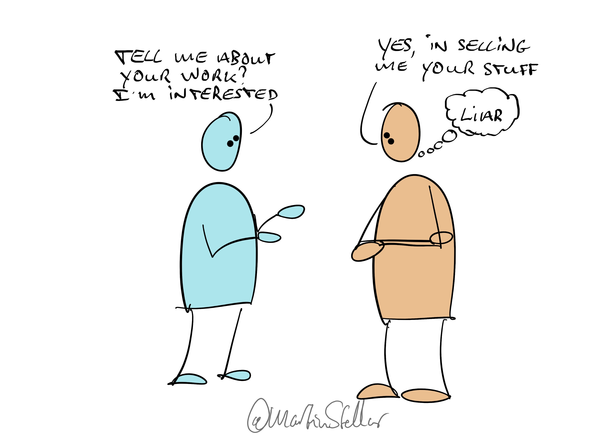

---
tags:
  - Articles
  - EthicalSelling
  - Integrity
pubDate: 2024-09-04
type: sfcContent
location: 
cdate: 2024-03-14 Thu
imagePath: Media/SalesFlowCoach.app_How-to-generate-leads-without-lying-or-scuzzy-tactics_MartinStellar.jpg
---

"Hi Martin, I just saw your article!", read the LI message in my inbox. "Can you send me some more information about your work?"

Most business owners would go "Cool, a lead! This content marketing is working!"

But of course if you're a sales guy and a salty dog like me and you're skeptical, you test:

"Sure, but to make sure that you get the right information, can you tell me what specifically you need help with?"

And there the truth comes out, once I receive a reply:

"We help coaches yada yada... we provide services etc etc... want to find out more?"

Ah. Just as I suspected: ye olde bait & switch:

Stop short of outright lying, but carefully create the impression that you're interested in hiring someone. And when they respond?

Wonderful! You now have a lead you can sell to! Whoohoo, look at me doing lead generation!

Uhuh, yes. Except your deceitful tactics get you blocked, and disqualify you, making you someone I'd never ever touch, not with a 10-foot pole.

The fact that tactics like this exist is exactly why I'm in business: to show entrepreneurs with [[📄 How to sell more because of your values... and not despite them|actual values]] and non-negotiable morals, that you can generate leads and business and revenue, without having to stoop to scuzzy deceitful tactics.

How?

By leading with values. By putting your cards on the table, and clearly stating your intentions. 

By being upfront, honest, and truthful. Not only does that allow you to stay true to your values, it also increases the chances that people listen to you, engage with your message, and, yes, that they actually buy from you.

And to acquire the strategies, tactics, and methodologies that let you sell with 0% scuzziness, get yourself some [Sales for Nice People](https://martinstellar.com/sales-for-nice-people-info/).

