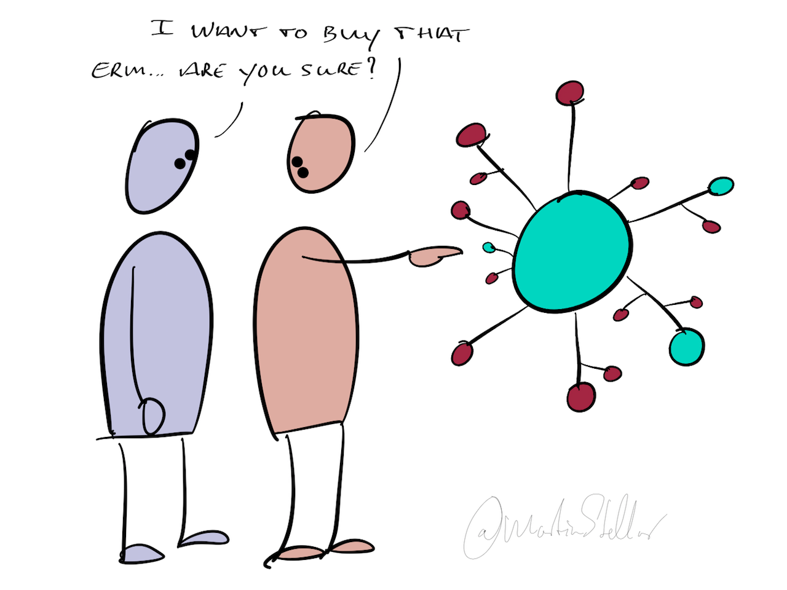

Each time we make a decision, we’re effectively looking to 'purchase' something.

Either we want to add something to our lives - an outcome or a result or an asset - or we want to remove something, in which case we're looking to purchase freedom from something.

Where we often go wrong, is in looking only at the attractive and compelling reason we want to make the decision... without looking at the unexpected consequences the 'purchase' brings along.

For example: if you decide to get married because you want to purchase 'freedom from being alone’, you also purchase ‘less time spent with your friends’.

Or if you decide to hire a marketing agency, you want to purchase ‘more leads’, and while you probably factor in your capacity for taking on new clients, you’re also purchasing 'more cognitive load, more mental real estate'.

Because more leads means: more conversations, and that means you’ll be spending time thinking about all the extra leads and their needs.

In business and marketing and sales, you need to consider the secondary purchases that go along with the decision to 'purchase' this or that thing.

On the surface, this looks like nothing more than considering opportunity cost.

But it’s actually much more powerful than that, because what I’m pointing at is systems-thinking.

Your business is an interacting whole of incomings, outgoings, unknowns, problems, dynamics, conversations, opportunities, and a whole bunch more things. It's an inherently complex system.

Even if your business *model* is simply ‘run ads to my course on Gumroad, and plug all profit back into running more and more ads’, you're operating a highly complex system.

Niches, split testing, planning for your next course, adhering to Google’s adwords policies, payment integration, social and political dynamics that affect people’s attention and time-spend and therefore change the efficiency of your ad campaigns:

It’s a simple business model, but it’s still a complex system.

And whenever you decide to purchase an outcome, you need to not just think about opportunity cost, but also about how the additional acquisition causes a ripple effect throughout your business.

Nothing is as simple as ‘if this, then that’.

Every decision and every acquisition is ‘if this, then that, and that, and that, and also that’.

It’s not enough to think about linear, short-range effects.

If you want your business to be wieldy, and fun, and lucrative, you also need to think top-down, as in: systems-thinking.

And, you want to bias your decision-making towards purchases that have as many _positive_ secondary outcomes as possible.

Quite unlike most people’s attitude, where they know that there’s a couple of negative secondaries in there, “But hey, we can handle that, no problem!"

When you find yourself saying that - when you’re making negative secondaries into ‘no big deal’, you’re about to make life worse for yourself, not better.

Always prioritise purchases with positive secondary outcomes, and always consider and mitigate the negatives that can come along with it.
