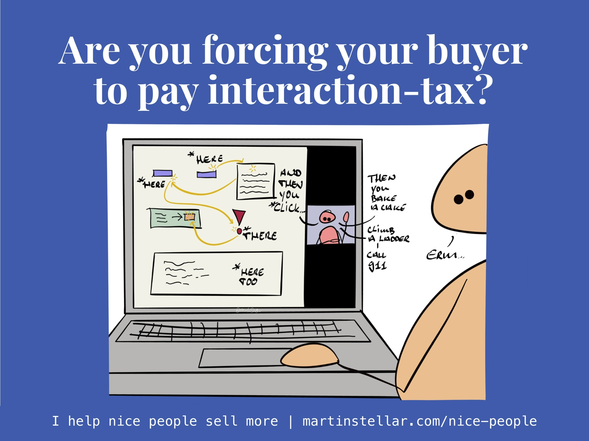

<iframe width="100%" height="180" frameborder="no" scrolling="no" seamless="" src="https://share.transistor.fm/e/fe03c65a"></iframe>

Today in "Are you selling them a problem?", here's another pointy question for you:

Are you forcing your buyer to pay 'interaction-tax?'

Because we all do it, and it's a fine and tested way to ruin a sale.

Like that developer I spoke to a while back: he showed me his app, wanting advice on how to raise money for building it out.

It looked great, definitely a solution to real-world problems. But in how he presented it, using it looked like a lot of work. Pages to click through, lots of scrolling, lots of clicking...

And it's not that there was anything wrong with the app - it's simply that he was explaining it from the POV of an engineer, which meant that I experienced overwhelm, instead of a desire to lean in.

And there's many different ways we levy interaction-tax on people:

- [[📄 Keep your messaging short|An email that’s long]], and carelessly worded? Or overly cerebral, academic almost, wrought in Highly Intelligent Reasoning?

Now your buyer needs to allocate mental resources to even grasp the core of your message: you're making them pay interaction-tax.

- A Zoom call with a buyer, where you let them ramble and you don’t guide the conversation to a result of some sort?

They just spent an hour with you, and no real advance was made: Interaction tax. (Also see: [[📄 How to make sales and lots of money by constantly interrupting your buyers|why and how to interrupt your buyer]])

- Need to tell an employee that you’d like to see them take more responsibility - but you cloak it in a ranting complaint about company morale? They now need to have a little lie-down because your rant drained them and they paid interaction-tax.

In so many ways, so very often, we force people to pay a cost to interacting with us, and it goes directly against results, and against everybody’s interests.

My favourite pet-peeve in this context?

Those blighted audio messages people are always sending each other on Whatsapp. Horrible things.

Oh, so you can’t be bothered to think out, and type up, a pithy, 1-sentence message?

Well, now the recipient needs to spend 90 seconds listening to you rambling and thinking into a microphone, about something that you could have delivered in the shape of a 2-second read. Your recipient pays interaction tax.

Of course it’s not your intention to make people pay for dealing with you - but it’s crazily easy to levy interaction tax on others, and we all do it, all the time.

So be careful to avoid it, especially when you’re dealing with a buyer.

Any interaction they have with you, be it written feedback on something, or an email or text reply, or a work meeting or coaching session:

Carefully tailor your interaction and messaging to be as friction-free and low-cost as possible for the other.

Keep the cost to interacting with you low and frictionless, and you’ll magically start seeing things move more smoothly with everyone - including your buyers. Especially your buyers.

Ohey, and if you REALLY want to move things forward with your buyers?

Then obviously Sales for Nice People is the way to go, even if I say so myself.

Why?

Because I build the methodology specifically for good eggs and high-integrity entrepreneurs - the kind of people who are far more interested in solving a buyer's problems, than in getting the sale.

Except if you don't know how to make the sale happen, you don't get the sale and you don't get to solve your buyer's problems. Or you'll be selling at too low a price and you're always struggling to keep up with your workload.

Sales for Nice People solves that. More sales, more money, more time to do an absolutely cracking job for your buyers. 

Info and access [right here](https://martinstellar.com/sales-for-nice-people-info/)

.
