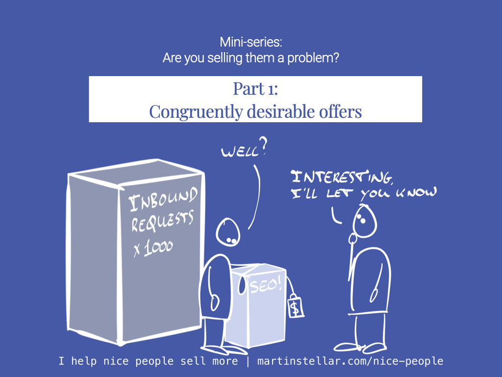

---
assetFile:
  - "[[Are you selling them a problem_assets]]"
cdate: 
docStatus: Slated
episode: "2"
imagePath: Media/SalesFlowCoach.app_Are-you-selling-them-a-problem-pt1_MartinStellar.png
location: 
path: 
pillar: 
podStatus: Published
priority: 
prodStatus: 
pubDate: 2024-07-02
schedRelease: 2024-06-30
series: selling-problem
series#: "1"
status: 
tags:
  - Articles
  - SellingProblems
  - AdoptionCost
title: "📄 Are you selling them a problem? Mini series Pt 1: Congruently desirable offers"
type: sfcContent
---

One of the best ways to lose a sale, is to inadvertently 'sell a problem' along with your solution.

“But wait!”, you say:

“I don’t sell problems... I sell a solution!”

Of course, that’s what business is about: earning money for solutions.

But it's just too damn easy to offer a solution and be unaware of the attached problems or consequences your buyer will have to deal with.

For instance, in the field of productivity and procrastination, there's a question psychologists like to ask:

Is this goal congruently desirable?

As in: if your goal is to generate a million dollar in sales, then getting the cash is definitely desirable.

But if that also means you have to hire a team and that means your peaceful solo-trader life goes to pieces, the overall goal is not at all congruently desirable, and you bet that your subconscious is going to do whatever it can to trip you up, and prevent you from hitting the target.

Or a buyer looking to implement SEO, and they'll get tonnes of visitors... but then they'll also have to deal with dozens or even hundreds of inbound requests, and where are they going to find the time to deal with all of that..? SEO guy gets no sale :/

And the same thing goes with your sales, your buyers and your offers:

If your offer isn't congruently desirable for your buyer, there's no sale.

The outcome you promise might be 100% desirable for your buyers, but a secondary consequence of that offer might be - very often is - the reason why a deal won't move forward despite all the stars being seemingly aligned.

In other words, you might be 'selling them a problem', along with your solution.<!--(I've written about the various nefarious ways that can show up, for instance as [[_SalesFlow Coach/📄 Are you selling them a problem? (Pt. 3 - Interaction tax)|interaction-tax]], [[📄 Are you selling them a problem? (Pt. 2 - Adoption cost)|adoption-cost]], and [[📄 Are you selling them a problem? (Pt. 5 - Identity conflicts)|identity conflicts]]).-->

Don't assume that just because your buyer needs and wants your solution, you have everything needed to close the sale. Because as you'll have noticed - and if you're not sure, go into your CRM and count the number of deals gone stale, that you were certain would close - the fact that a buyer needs your solution, isn't enough.

If a deal ain't happening, stop the trite 'just following up' messages, and ask yourself some intelligent questions about your buyer. Ask yourself what might be in the way, what problem or perceived threat their subconscious might be struggling with.

And once you have an idea of what that might be, then you follow up, and then you say intelligent, considerate, response-generating things like:

"Hey that SEO project we discussed - I understand it's not going to happen for the time being and that's fine.

"But since you seemed ready to kick it off, I'm just curious - was it indeed the prospect of having to deal with a large numbers of inbound leads, that got in the way?"

With a question like that, you're probably not closing a sale. But unlike "Hey, just circling back!" crud, you likely won't get ignored, and you're likely able to continue the conversation, which is required for any sale to happen at any point, which it won't if you say things that get you ignored.

Anyway.

This type of approach - the thoughtful, methodical, empathy-based process of dealing with your buyers and your communications, works a charm, and it's exactly that which you'll learn in the ten-week Sales For Nice People training.

It's $1500 for the ten weeks, you get 20 minutes of 1 on 1 training each week and 20 minutes of coaching on your deals, and it works.

So the question is:

Is that offer congruently desirable for you?

If not, what's the hidden problem that keeps you from getting on board with the programme?
