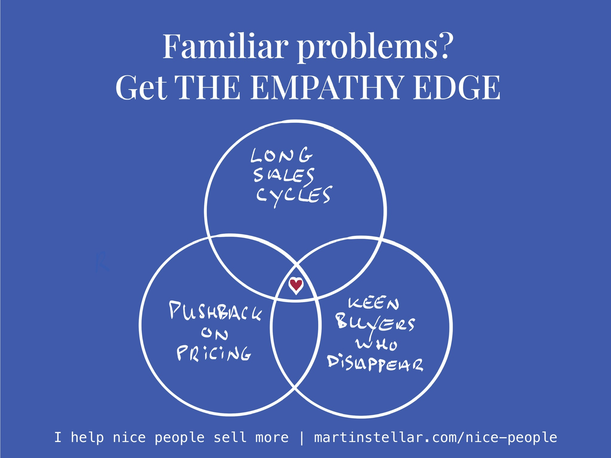

---
tags:
  - Articles
pubDate: 2024-09-06
type: sfcContent
location: 
cdate: 2024-09-06 Fri
episode: 
imagePath: Media/SalesFlowCoach.app_The-Empathy-Edge_MartinStellar
---

The other day I wrote that as a seller, it's your job to [[📄 Make it easy to buy|make it easy to buy]], so I figured I'd show you an example of how to do that in the shape of what my friend and mentor Rob Gelb calls a 'stupidly good offer', i.e. a loss-leader.

The key to making offers like that work, is meeting people where they're at, and offer a simple, low-risk solution, that solves a very specific problem.

Here's the deal:

Next week I’m running an online workshop, where I'll be teaching how to use [[🤗 The Empathy Edge|The Empathy Edge]]: a very simple but terrifically effective psychological lens, that helps you truly get your buyer, and their needs, and the concerns and objections that they have.

Once you get the Empathy Edge, it helps you solve three problems that I see lots of people struggle with, in case this is where you're at:

Long sales cycles, keen buyers who end up not buying, and pushback on pricing.

Here's what you can expect:

- A 45-minute workshop + Q&A
- Topic: The Empathy Edge: How land more consulting projects by using psychology to truly get your buyer
- Date: Sept 12 at 15.30 CEST / 14.30 GMT / 12.30 Eastern
- Includes 3 followup-calls to help you with your deals (30 mins each)
- Attendance fee: $ 97

Registration is open until Monday 7PM GMT, and only 8 seats are available.

Would you like to join us?

Let me know, and I'll send you the details.

Cheers, 

Martin

