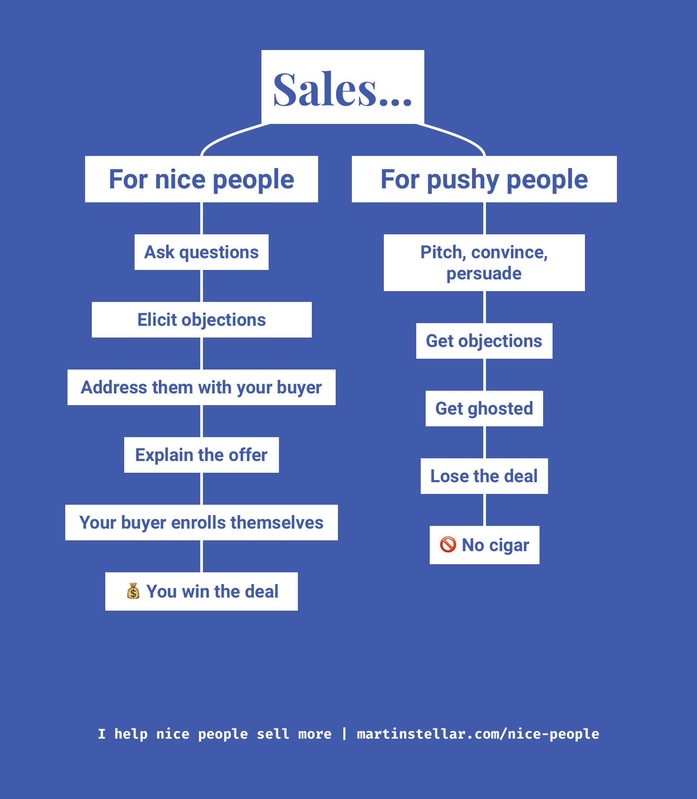

---
tags:
  - Articles
pubDate: 2024-07-22
type: Landing
location: 
cdate: 2024-07-22 Mon
episode: 
imagePath: Media/SalesFlowCoach.app_Ask-your-way-to-the-sale_MartinStellar.png
podStatus: Published
---

It's astonishing how many people - even seasoned sales professionals - get it wrong:

Thinking that in order to land a sale, you need to pitch at people.

That you need to state your case so compellingly, so resoundingly persuasive, your buyer has no choice but to go 'OMG that's it, take my money!'.

In reality, pitching rarely works. Worse than that: when your pitch doesn't work, it's pretty much guaranteed that your deal is lost.

Which is logical: to get a pitch right, and have it work, you need to know exactly, with precision and calibration, what to say to your buyer.

But in most situations, you and your buyer are new to each other, and all you know is that they have a problem and a need for a solution.

And with that, how will you know what your buyer wants to hear, needs to hear, in order to decide to hire you?

You don't, of course. Which is why *pushy people pitch, but nice people ask questions*.

Because the hard fact is that no matter how well your offer is suited to a particular buyer, there will always be concerns and objections.

Traditional selling then teaches you 'objection-handling', but that's frustrating, a losing battle.

Much better to have a sales conversation based on questions.

Because when you ask your way to the sale instead of trying to talk your way to the sale, two things happen:

First, you learn what exactly what you need to say to your buyer, and:

In the process of asking questions, you elicit objections, which you can then address together with your buyer, long before you even get to asking for the sale.

With the massive upshot that once you do ask for the sale, most all objections will already have been dealt with.

This is why the first modality of conversation in SFNP is Questions. Because questions give you data, and intel, and they help your buyer enroll themselves in the process and the sale.

Questions are what your buyer needs to hear, in order to figure out whether hiring you is indeed the right choice, whereas pitching and persuading will only make them come up with objections, which you then have to - unsuccessfully, usually - 'handle'.

And once you learn how to ask questions, and which ones, and what to do with the answers?

Well then your entire sales process shifts, from something that you do because you have to, into something that you do in order to help your buyer.

The result? More sales, less frustration, more money.

How to get those results?

[By clicking this link](https://martinstellar.com/sales-for-nice-people-info/), and then getting yourself in on the 10-week personal training programme.

Meanwhile, I recorded a short video for you with some more information:

<iframe src="https://fast.wistia.net/embed/iframe/418y0swbey?seo=true&videoFoam=true" title="Sales for Nice People Video Sales Letter" allow="autoplay; fullscreen" allowtransparency="true" frameborder="0" scrolling="no" class="wistia_embed" name="wistia_embed" msallowfullscreen width="100%" height="100%"></iframe>

