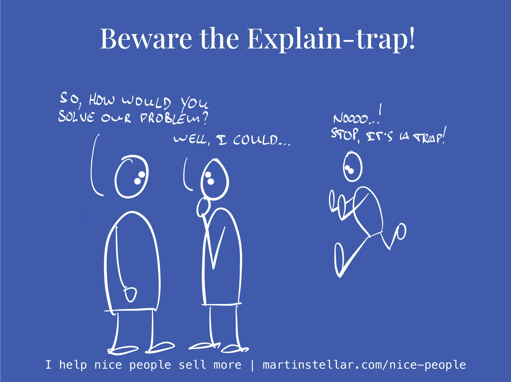

---
tags:
  - Articles
  - SalesForNicePeople
  - Explaining
pubDate: 2024-09-12
type: sfcContent
location: 
cdate: 2024-09-12 Thu
episode: 
imagePath: Media/SalesFlowCoach.app_Beware-the-explain-trap_MartinStellar.jpeg
---

"Martin, do you think you could get our sales team to take us from $14 million per year to $16 million per year?", said my buyer.

"Possibly, maybe, depends."

He liked my answer, and said: "Ok, so how would you do that?"

"Well, there's sales training of course, my Sales for Nice People system. And, there's probably some work to be done in terms of pipeline management, messaging, and we'll also need to analyse which 20% of your buyers bring you most revenue, and..."

I caught myself and stopped, because I realised: I was beginning to fall into the explain-trap.

So I said: "Actually, before I can answer your question, there's a bunch of questions that I need to ask you first, if that's ok?"

It was, I asked, and I landed the client.

Which is something that very possibly would not have happened, had I continued to talk, falling deeper and deeper into the explain-trap.

By which I mean: an effort to lay out your case, explain how your work works, and trying to have your buyer see the sense and logic in how you do your magic.

See explaining is crucial and vital, in fact it's one of the 4 pillars of Sales for Nice People, but:

When you start to explain the how and why and wherefore too early, before your buyer has shared their concerns and needs and wants and motivations, you run into a problem:

You might make a solid and logical case for why it's a good idea to buy your coaching or consulting, but exactly because you don't know much - or even anything - about your buyer's situation yet, what you're doing is effectively the conversational equivalent of sending people a brochure or a proposal:

A logical and sensible set of arguments, designed to hopefully get the buyer to be interested.

And you've probably noticed that sending pitches, proposals or brochures does practically nothing in terms of generating interest.

But if you first get a buyer to open up, to share, to let you into their world, and they confide in you by telling you what they want, why they're stuck, what frustrates them?

Then they have shared with you all the things they are interested in, and if you **then** explain how your work works, well then you are speaking to something they care about. They'll be open, receptive, interested, and they'll be listening to you while trying to figure out how to integrate your proposed solution into their world.

This is why it's so important to avoid the explain trap.

Never explain too early, always make sure you get data and intel first, and only start explaining your work once you properly and truly get your buyer.

Anyway, there's a lot more that goes into the psychology of it all, so if you want to get a lot more, the 16-week SFNP training will get you that.

Couple of things to remember:

The price will go up starting Monday, the sessions are weekly, one on one and include deal coaching, and you'll get daily access to me by email, to keep you on top of your deals and keep you moving forward to closing them.

[Access is here.](https://martinstellar.com/sales-for-nice-people-info/)

See you on the inside?

Cheers,

Martin
