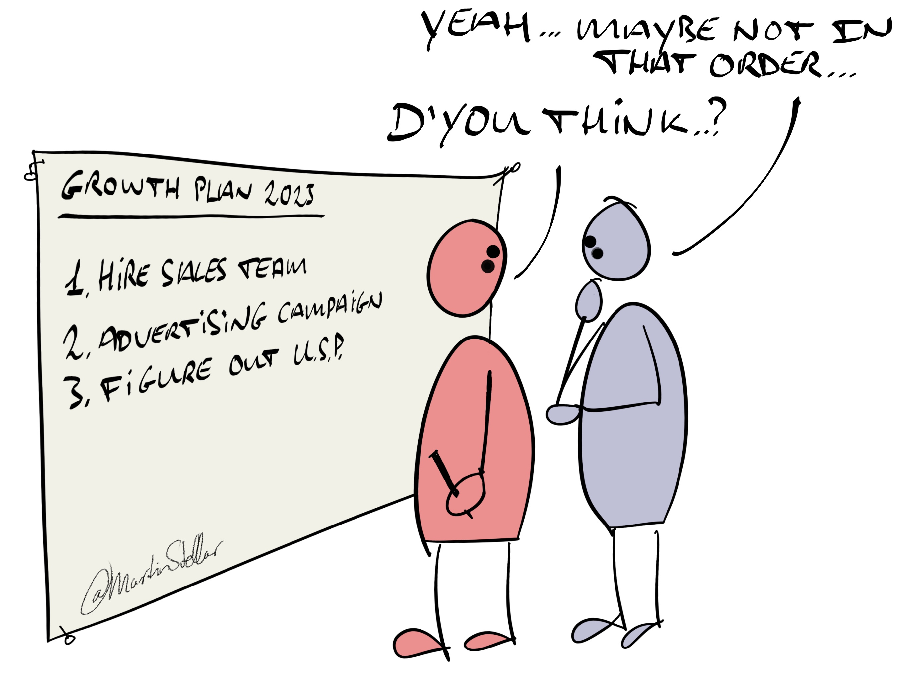

Of course: you wouldn't add the butter *after* the eggs are fried.

We all know that things only work when you do them in the right order.

And yet:

You too might have some things out of sequence in your business, and working in the wrong sequence is one of the worst things you could do - it can cost you vast amounts of money and time, and it can even bring down a company.

For instance:

Spending money on ads, before you've gotten laser-like focus on your most lucrative niche, and the messaging that those people need to hear, is a terrible mistake.

Boom, gone is your ad budget, and all you got was this lousy t-shirt from Facebook that reads "Gotcha, sucker".

So the first thing you want to do, is answer the questions Who, What & How.

Most people start with the How part: "This is how I can help people solve problem X".

And then they go out looking for people who might want that problem solved.

But then you become a solution looking for a problem to solve, and that’s a long, arduous, very windy road - you’ll see why in a minute.

Instead, you want to start with Who.

Who are the people that you want to work with?

What about them makes them a good fit?

What do you know about them?

And most importantly: what do you *not* know about them?

Because that brings you to part 2: What.

What is it like to be in their shoes?

What annoying, pesky, costly problems do they deal with?

And, which of those problems do they actually want to solve?

And, literally the million-dollar question:

Which of those problems are so costly or painful that they actually want to pay to get them solved - and, get them solved *now*?

Because that last one is the only problem that you should try to solve.

That’s the only solution you should try to sell.

Anything else won’t be considered important enough, and/or they won’t want to pay for a solution, or they'll keep putting off the decision because it just isn't a now-thing.

This is why doing things in the right order is so damn important.

Because if you start with a solution (the How) and you try to sell it, you might well be selling something people won’t buy.

Or, you might be using messaging that just doesn't work for those people.

That’s why you start with Who, followed by What, and only then do you move on to How.

That’s how your marketing and sales become lean, efficient, and measurable.

For a short deep-dive on the different stages of business growth, the ingredients that belong in each stage and why & how to not screw things up by doing things out of sequence, dig into [[👨‍🎓 Mini-training - Introduction to Stages & Ingredients of Business Growth (SIBG) Pt. 0.0|the SIBG Mini-Training.]]
