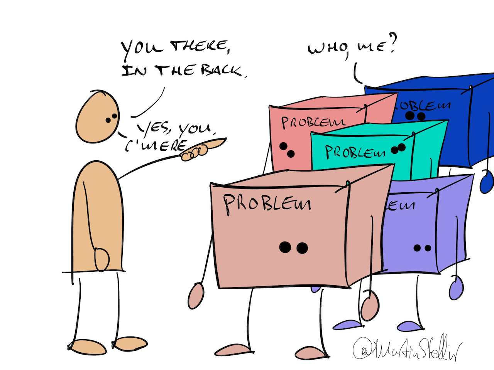

At any given time, there’s a million things you could try to fix, change, or improve in your business - there's always a million different problems you could solve.

But which one are most in need of solving?

Those that are easy to solve often don’t make that much of a difference, whereas the hairy problems are often too complex or time-consuming to tackle.

And yet, the hardest, most complex, most complicated problems tend to make the biggest difference once they get solved… except we avoid it, because they’re so complex, and because they're important but not urgent.

To break through the rut of solving trivial problems, the solution is to look for the problem behind the problem (similar to Toyota's 5-why’s exercise).

If ‘no traffic to my site’ is the problem, an obvious solution would be ‘fix SEO’ or ‘start guest posting’ or ‘start a podcast’.

Or you could ask yourself why you have no traffic to your site, and you realise that behind ‘no traffic’ lies ‘no visibility’, and behind that you might find ‘never made visibility a priority’ and behind that ‘insufficient attention to long-term business sustainability’.

Once you get to that insight, you realise that improving SEO might be a good problem to solve, but it won't solve the actual, underlying problem, of not thinking long-term enough. And so the SEO solution might help, but it won't make a proper difference, won't give you what you ultimately want. The SEO problem just isn't a very high quality problem.

A pretty nice discovery on the heart of the matter, I’d say.

And if you then solve *that* problem, and you *do* make long-term thinking a priority, you might end up with solutions and actions that don’t just bring traffic, but that make your business healthier in general.

The problems you look at are only the surface.

Dig deeper before trying to solve them, so that you can ignore the menial and trivial, and work on what really matters.

Now if your business has a problem to do with sales and revenue, and if some clear analysis reveals that your personal skills in finding stranger and turning them into buyer is the problem, SFC Academy launches in the new year, and was designed to solve exactly that problem: More sales, faster, with less struggle, and at better prices.

Details [here.](https://salesflowcoach.app/academy)
