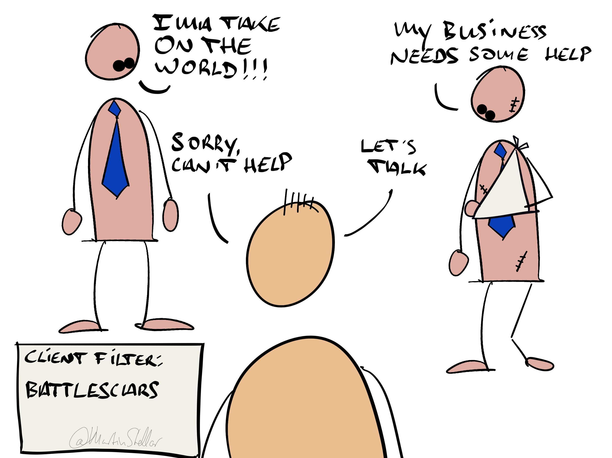

Some clients are just a dream to work with:

They show up on time, they do the work, they say “Ok, how?” instead of “Yes, but”, and coaching or consulting them is fun and effortless.

Others are hard work: they argue for their limitations, they sabotage their efforts, or they blame everybody but themselves.

Or, they constantly put up a fight, trying to convince you of why their wrong ideas are right.

Would be nice to know, before they hire you, which of the two kinds a new buyer is...

But how can you tell?

After all, very often, you don’t discover a client’s true nature and manner of operating, until you’ve started the process of working together.

So here’s a simple filter, a question to ask:

Do they have battle scars?

As in: Is this their first business?

If not, are they new to the game of being an entrepreneur - are they just starting out?

Because if they are, and they’re all excited and motivated and [[📄 Who to ignore (do they wear a business face?)|naive to the realities of being in business]], you might be in for a long and arduous struggle in trying to get them to success and results.

A salty dog however, a seasoned business owner with failures and challenges and struggles behind them, that’s usually a far more workable type of individual.

They bring humility, a student’s mindset - and they tend to work **with** you, instead of **against** you.

So if you want better clients and get more results for them, ask yourself:

This new buyer I’m talking to…

Is this their first rodeo, or do they have battle scars?

If not, you might do well to [[📄 Buyers That You Should Avoid Like the Plague|pass on the opportunity]], and look at more seasoned buyers instead...
