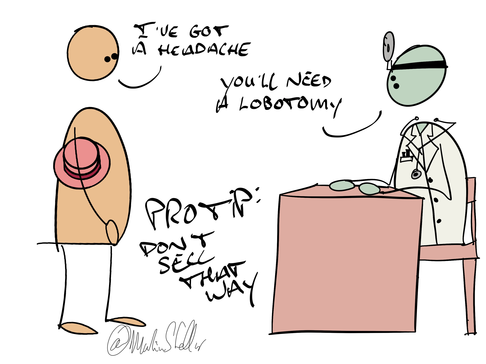

For a doctor to prescribe medication or treatment without doing a proper diagnosis is malpractice.

It’s the stuff that hurts patients and gets doctors sued, and rightly so.

It’s not just legal obligation and best practice: it’s the right thing to do, and as a business owner, our responsibility is not very different.

Yet each day, I see people with a great product or service, real good eggs trying to make a difference, and they ruin everything because they come charging in, brandishing their thing, pitching like there's no tomorrow, doing their everloving best to convince a buyer that they really ought to buy.

And sure, maybe the other person really does need your thing - but how would you know?

If you don’t properly ‘diagnose’ the buyer’s situation, needs, and urgency first, how can you know whether they need you thing or not - how can you prescribe before you diagnose?

If you solve problems for a client, the way a doctor treats illness, do you not solve problems better, and more often, if you first figure out whether or not people actually, really, need your thing?

Now, this goes beyond good practice and doing right by people:

It’s also an excellent attitude to take when selling.

Because when you ask enough questions so that you’re able to accurately diagnose a problem someone has, you’ll gain a deep insight into the problem, its causes, and possible solutions.

And if you then state the problem better than the person you’re talking to could state it, they’ll automatically become interested in your solution.

And if that solution then is right for them, at this moment, [[📄 Do you sell, or instead do you enroll...?|they’ll enroll themselves]] - no selling or convincing required.

This is how nice people land their sales: by asking questions and diagnosing problems so well, that buyers enroll themselves. 

Learn how over the course of 16 weeks, with live, 1 on 1 training, including weekly coaching on the deals in your pipeline. 

[More information here. ](https://martinstellar.com/sales-for-nice-people-info/)
