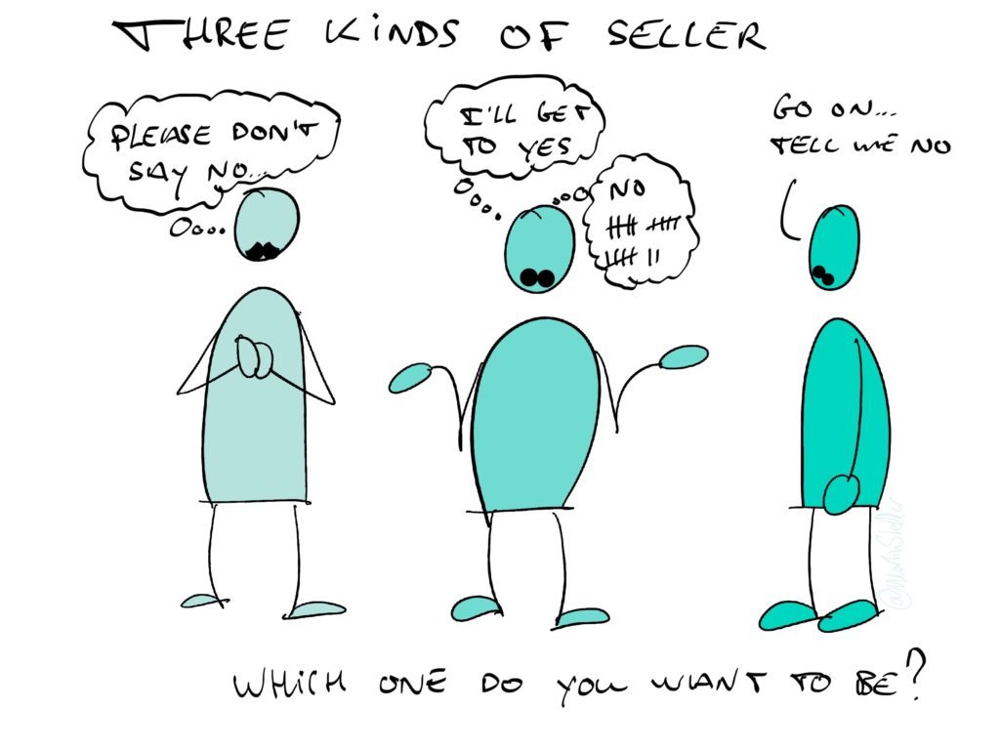

When it comes to enrolling people in buying your work, there's three kinds of seller:

There's those who fear hearing ‘no’, and get upset or frustrated.

Then there’s those who know that hearing ‘yes’ follows hearing ‘no’ a whole bunch of times.

And then there’s those who actively seek out a no, because - as the late Jim Camp taught - ‘no’ is when the negotiation starts.

But when you hear a no… what’s next?

What’s the best reply when a prospect tells you no?

According to Chris Voss, your best move is to say something that gets a ‘that’s right!’ out of your buyer.

Not ‘you’re right’, because that message basically says ‘whatever, stop talking’, but ‘that’s right!’

What happens when someone reacts that way, is that their brain registers your empathy, which instead of breaking down the negotiation, strengthens rapport and connection, enabling you to continue the conversation in a way that’s non-threatening for them.

At the same time, there’s a kind of epiphany happening: they realise that you get them, see them, hear them.

As opposed to the (stupid, arrogant and old-fashioned) tactics of trying to persuade the other person.

So what do you say exactly, how do you get a ‘that’s right!’ out of a buyer?

It’s so simple:

“Ok, so what you’re saying is that this isn’t right for you, because \[insert the reason they just gave you] - is that correct?”.

And that’s it, that’s all there is to it.

A simple question, and bam: you’re on the same page, ready to keep talking. And while that may not directly lead to a sale, it does keep the conversation going, which is required for any sale to happen in the first place. Besides, you never know who your buyer might introduce you to, once you've gracefully accepted their 'no', which again is something that wouldn't happen, if you'd let the no shut down the conversation.
