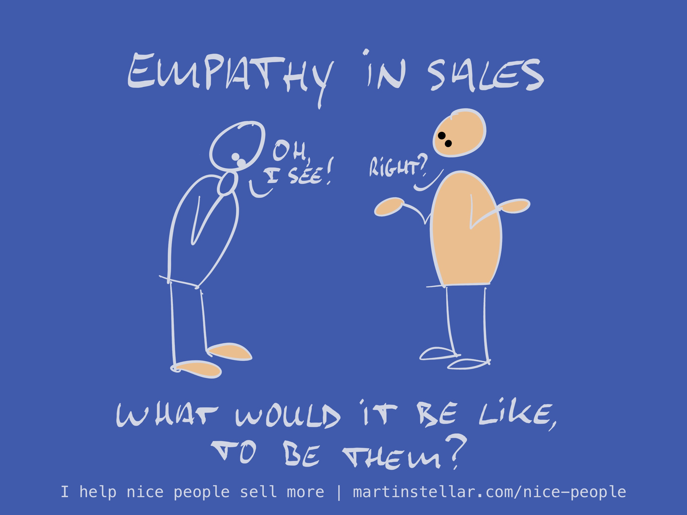

---
tags:
  - Articles
  - Identity
  - Lenses
  - Perspective-taking
pillar: Lenses
cdate: 2023-03-15 Wed
pubDate: 2024-10-22
docStatus: 
type: sfcContent
imagePath: Media/SalesFlowCoach.app_Empathy-and-perspective-taking-in-sales_MartinStellar.jpeg
---

The ability to shift your perspective on things is a powerful tool, when trying to make things work with people or getting people to buy.

If to you, John represents "That buyer who's been ghosting me for two weeks, and that I now have to follow up with", that will have you write: "Hey John, any news on that proposal?".

But it's very different when John represents "That buyer who tries hard to stay on track, but his boss always creates chaos by coming up with new ideas", because then your followup might look like:

"Hey John, not heard back from you yet... I suppose your boss came up with yet another great idea for a project. Anything I can do to help?"

The first will get you ignored.

The second will probably get you a "Yes, he did - but there's no way around it. Thanks though!" - which doesn't get you the sale, but you sure stopped being ghosted.

This is why it's so important to use *lenses* when dealing with people, where a lens is a specific set of questions to help you learn your people and figure out what life is like for them.

Taki Moore, an Aussie coach, taught me a model based on Fears, Frustrations, Wants and Aspirations. I like to add Identity, and here's how it all goes together:

**[[😱 What are their three biggest fears?|Fears]]**
What three fears are the most important in your buyer's mind? What concerns them most, what's the biggest thing that could go wrong - what 3 things are they most afraid will happen?

**[[😫 What's their single biggest frustration that you can remove?|Frustrations]]**
What single frustration does that add up to?

What's the "I've had enough!" conclusion you can derive from the fears, what is your buyer fed up with?

**[[⭐ What are their three biggest wants?|Wants]]**
What three things do they want most, which are the three most important gains or achievements or enablements, as a result of solving the problem you can solve for them?

**[[🏆 What is their biggest aspiration?|Aspirations]]**
If they were to get what they want, what would they attain? On a personal or professional level, what outcome do they *aspire* to?

**[[👤 What change in identity will take place when they buy?|Identity]]**
If [[📄 When they object or resist... is it because you're selling them an identity they don't want?|people don't buy products but a new version of themselves]] (as per Steve Jobs), and buying from you means that they solve a problem, what does that say about them and who they are?

In what way will they upgrade their self-view when they win, what new version of themselves are they looking to become?

**How to:**
Any time [[📄 Two questions you can ask when a buyer ghosts you|you get ghosted]], or a deal is stuck, or you're abut to send followup that doesn't do anything other than nag the other person on:

Sit down with a piece of paper, and give yourself 10 minutes to jot down some answers to the questions above.

Make it a habit to reflect on your buyers this way, and I promise you'll see your messaging get more calibrated, relevant, and effective. And you'll be far less likely to get ghosted, which is pretty useful given that no sale can happen if you don't get a reply. 

Next up: For a deep-dive on these questions, check out the free [[🤗 The Empathy Edge|Empathy Edge]] series.

And, for a proper and transformative learning experience that will radically improve your communications skills for the rest of your life, consider [Sales for Nice People.](https://martinstellar.com/sales-for-nice-people-info/)

