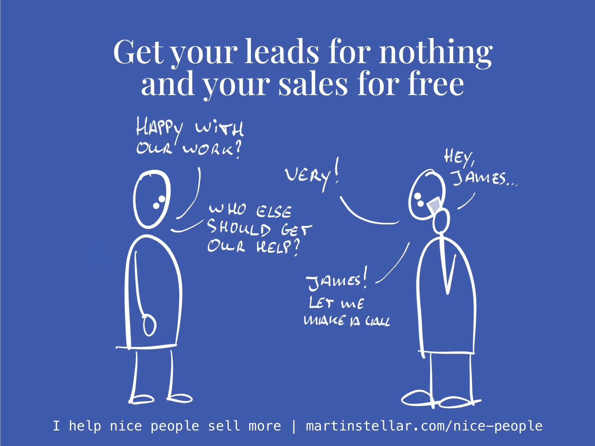

---
tags:
  - Articles
  - Hidden-Sales-Assets
  - Leverage
  - Leverage-Relationships
pubDate: 2024-08-12
type: sfcContent
location: 
cdate: 2024-08-12 Mon
episode: "31"
imagePath: Media/SalesFlowCoach.app_Get-your-leads-for-nothing-and-your-sales-for-free_MartinStellar.jpeg
podStatus: Published
---

Here's three simple steps for generating leads and sales for free, without having to cold-call or spam people.

Because hey, generating leads and sales can be difficult, and indeed the question of 'how do we find strangers and turn them into clients?' is a tough one.

But if you change the question, you just might find that you have far more opportunities than you thought.

For instance, a useful question is: How can we generate more revenue from the marketing and sales efforts that we've already invested in?

With that question, the whole game changes. Because now you get to play the leverage game - especially if you carefully consider and analyse the people who have bought from you in the past, and you ask them a few specific strategic questions.

In fact, here's three simple steps you can take today, to generate more conversations, opportunities, leads and sales. Let's go.

Step 1: Analyse your list of past buyers, and create a segment based on the following questions:

- Which 20% of these people gave us 80% of our revenue?
- Which segment has been most satisfied with our work?
Step 2: Contact each of those people with the following message:
Subject: research - help please?
Hi {firstname},
We're doing some research to better understand the value we bring and who benefits most from our work.
Would you help out and share some of your opinions? 20 minutes on Zoom is all it takes.
Thanks!
Step 3:
Have a friendly chat with your previous buyers, and ask them these questions:
1. Why did you decide to buy from us, and not someone else?
2. If you were to recommend us to someone else, what would you say?
The answers will give you your USP, in the opinion of those buyers.
Next, you need to choose one of two options:
1. If you sense that this buyer needs more help from you, you can ask: "Given what you've said about our work and the benefits, would you like to discuss some other ways we might be able to help?"
2. If you don't get the feeling they're open to another purchase, or if they decline the invitation, ask:
   "Who do you know, who should also get the benefits, stewardship and outcomes that you described?"
Because your past buyer has just reviewed and expressed the different reasons for being happy with your work, there's a non-zero chance that you'll either get a new opportunity with them, or that they'll introduce you to one of their peers.
And yes, it really is that simple - and that free - to generate new opportunities and sales.
So before you go and spend money on getting new leads, spend some time and leverage the money you've already invested.
Cheers,

Martin

P.s. I know for a fact that many of my readers have quite a few opportunities - and dollars - to harvest, from past buyers. If that's you and you would like my help analysing your buyers, and preparing the best possible interview so as to get the highest possible return out of the buyers you've already paid to acquire, get yourself a Breakthrough Session.

And, bonus:

I'll add in a 30-day subscription to SFC Personal, which means for a whole month, 5 days a week, you can send me as many messages as you like, and I'll help you turn your new opportunities into sales.

After checkout you'll directly receive a link to my calendar, which means you could have my help as soon as tomorrow. Don't miss it.

[Get your Breakthrough Session here.]()
