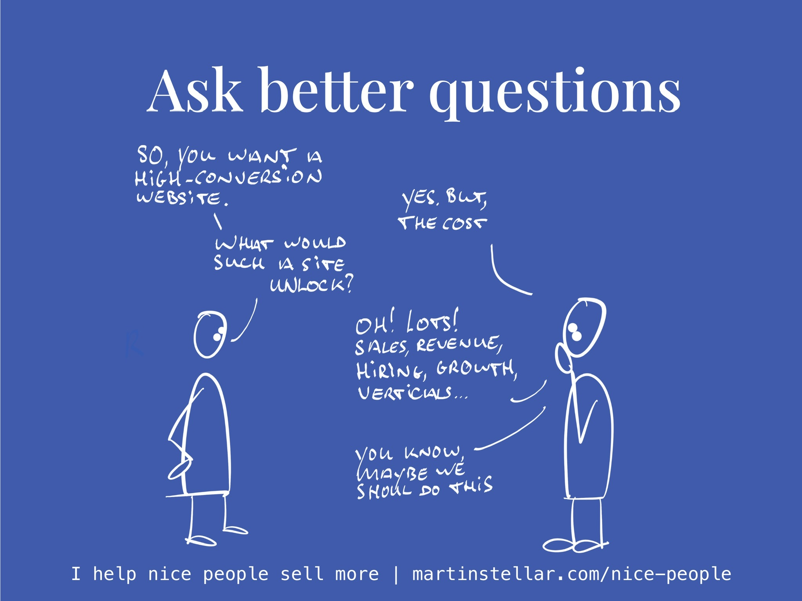

---
tags:
  - Articles
pubDate: 2024-10-10
type: sfcContent
location: 
cdate: 2024-10-10 Thu
episode: 
imagePath: Media/SalesFlowCoach.app_Give-them-questions-not-answers_MartinStellar.jpeg
syncdata: "1"
---

If ethical selling is about being helpful to your buyer, then one of the most helpful things to do, is make them think.

Think about the [[📄 Purchase motivators - Problem-cost and urgency|problem-cost]], think about how buying will [[📄 Purchase Motivators, Pt.1 Identity|upgrade their identity]], think about the ways buying will enable or unlock things in their business...

There's a host of considerations that if your buyer were to spend time thinking about them, it would get them clarity and vision and it would make it easy for them to make a decision.

And that's where a lot of sellers miss out and go wrong.

Because the default approach is to provide ideas, insights, notions, argumentation.

And while trying to feed those into your buyer's brain might be helpful to some degree, it's nowhere near as helpful as asking questions.

Because when you ask a question, you're making your buyer process, compute, weigh, consider - you make them *think*.

And the better quality thinking we do, the better the quality of our decisions. Which, when you sell a quality service, obviously means a quality decision would be to buy your offer.

From [the book:](https://martinstellar.com/book)

> Your job in selling isn't to make people buy your thing.
Your job in selling is to make your buyer *think*, so they'll get the clarity they need to make a decision.
More on that later, but for now internalise the fact that:
The better your questions, the better and the faster the results that you can get with people.
Questions work everywhere.
Questions work in coaching, in therapy, in marriages and in science, and yes:
Asking questions is the single most effective way for you to move deals forward and close sales.
Consider:
If the Wright Brothers had stopped at asking themselves "How do you make a human fly?", neither you nor I would be able to fly to Ibiza today.
But they started asking different questions, like "How long should a wing be, to create lift?", and "How big should the engine be, so that we reach the speed we need to create that lift?"
Better questions, and now we have planes. See you in Ibiza, I'll have a Martini.

So don't make the mistake of simply broadcasting your message at them, listing the features and benefits: 

Ask calibrated questions, that help your buyer think about what decision would be best for them. 

Here's an example: 

Would it be a good decision for you, to read a book on ethical selling, based in empathy and integrity, so that you can finally sell more of your work but without the awkwardness and without having to go against your values?

Yes? 

Excellent. [I wrote that book for you.](https://martinstellar.com/book) 

Seems like the book is being appreciated, so you might want to get yourself a copy. 
![[SalesForNicePeople.com-Goodreads-review-make-this-the-one-sales-book-you-read_MartinStellar.png]]