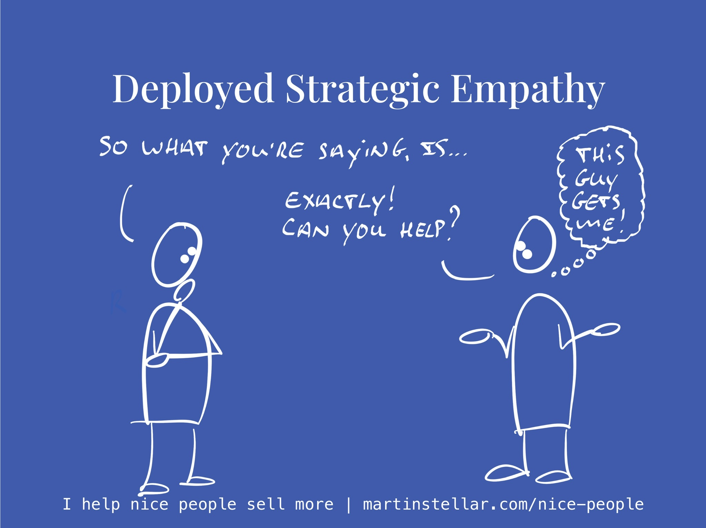

---
tags:
  - Articles
pubDate: 2024-08-19
type: sfcContent
location: 
cdate: 2024-08-19 Mon
episode: "36"
imagePath: Media/SalesFlowCoach.app_Deployed-strategic-empathy-in-sales_MartinStellar.jpeg
podStatus: Published
---

Once you really understand your buyer, it's often not that hard to create a sale.

Because when you truly get someone, your messaging will ring true, they will see themselves in the picture you're painting, and it becomes easy for them to say "Yes, this is for me, I'll take it, how do we start?"

And in order to get to that point, you need to deploy what I call 'strategic empathy'.

Which simply means: asking questions designed to elicit goals, desires, fears and frustrations, wants and aspirations, and, very importantly: the identity-piece, AKA the answer to "Who is your buyer looking to become?"

When you do that, you very quickly get to the point where the buyer wants to make a decision.

This is very different from standard (and boring, annoying, frustrating) sales techniques, where it's all about convincing arguments and persuasion.

Instead of stating things hoping you'll say the thing that gets the buyer over the line, you simply identify where their current situation is not congruent with how they see themselves in the world (i.e. identity), and you offer them the option to buy, and bring their behaviour into alignment with who they are and what they stand for.

For instance, I had a buyer ask me about the Sales for Nice People training. So, I asked a whole bunch of questions, found that this person truly wants to make things better (for themselves, their children, their clients), but struggled with a reluctance to actual sell the work.

So I explained that if you want to make things better by running a business, but you don't get over the challenge with sales, there's an incongruency between who you want to be, and what you're willing to do in order to become that.

My buyer saw the truth in it, and proceeded to checkout. Because this person is, truly, committed to making things better, and realised that the only way to achieve that, is to sell more.

I could have pitched, and reasoned, and persuaded ([[📄 Never convince, never persuade|which you should never do anyway]]), but instead I deployed strategic empathy, and enrolled a student.

So if your sales aren't working, stop the futile persuasion game, and deploy strategic empathy. It'll have your buyer enroll themselves, and you'll get to serve more people and create more impact with your work.

And, if you want to get a headstart on the remainder of the year, a Sales Breakthrough Session will make a big difference.

I've spent decades deploying strategic empathy, which enable me to query and analyse what you know about your market and your buyers, and turn it into messaging and positioning that causes more people to contact you and buy from you.

It's a 60-minute deep-dive, and [you can get it here.](https://martinstellar.com/salesbreakthroughsession/)