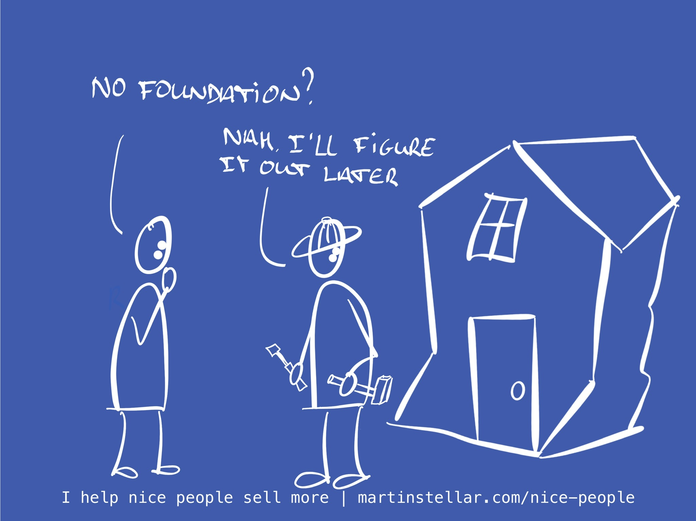

---
tags:
  - Articles
  - Hidden-Sales-Assets
  - Messaging
pubDate: 2024-08-13
type: sfcContent
location: 
cdate: 2024-08-13 Tue
episode: 
imagePath: Media/SalesFlowCoach.app_Don't-build-without-foundations_MartinStellar.jpeg
podStatus: Published
---

The other day a founder sent me a DM, asking me to fill out a survey for a community platform he's launching.

After some friendly back & forth, where I was asking myself if I should offer my help, I decided to ask him Question # 1 for any business success:

"What's your USP, what makes you different? Why should people choose your community over any of the other options out there?"

His reply? "I am hoping we'll eventually refine our USP".

Well, I sure hope so too, but more likely than not, he'll shutter his startup before he gets to that point.

Why?

Because your USP is not the thing that you eventually figure out - it's the thing you define before anything else.

Because without clarity on why people should choose you, how will you turn strangers into customers?

If you don't tell people why you're a better choice, why should they choose you?

In other words: because this founder has his USP relegated to a 'someday problem', he's effectively driving towards a cliff.

And I can only hope he'll realise that before he gets to said cliff, because it's a bit of steep drop. Failing to distinguish yourself in the marketplace is one of the easiest ways to achieve failure.

Without a clearly defined USP, your message sounds bland and generic:

"We're a community where you interact, learn, share, and support other founders".

Yep. You and thousands of others out there.

But if you run with a message like "We're a community of highly driven tech founders who don't want to be the smartest in the room", then you have a selling proposition that might just work.

People will see that, and they'll be able to self-identity: "Yes, I too am a bootstrapper. And yes, I'm well aware that the right community and social context makes all the difference."

In other words, once you get your USP right, your message communicates who it's for, why you're different, and what problem you solve: Differentiator, Avatar, Problem-stack, all wrapped in one neat statement.

Does that turn running a business into a breeze?

No, business will always be hard.

But without a good and specific USP, it's much much harder, and who needs that?

Anyway, you too have a differentiator.

And if you've never analysed your buyer's psychology and needs and what it is that makes you different and preferrable to the ideal buyer, then that might just be why you've not gotten more results from your efforts.

Fun fact?

Because of your years in business, you already have a hell of a lot of knowledge about your buyers, and why they should choose you over someone else.

All that's required, is to extract that intel and knowledge, and shape it into a nice and pithy statement that makes it easy for people to self-select and give you money.

And that's why it's such a good idea to get an HSA Breakthrough Session.

I've spent many years helping people work out their USP and messaging, going all the way back to when I was a copywriter.

And frankly, at only $300, a [Breakthrough Session](https://martinstellar.com/salesbreakthroughsession/) is just about the smartest choice you could make.

And who is it for, you might ask? And why should you want it, why would you self-select?

A BTS is for you if:

- You have a working process for marketing and sales, but too many people don't buy when actually they should, and you're frustrated that you're not earning more and making a bigger impact.
- You don't want to drive off of any cliffs
- And, you're someone who realises that foundations matter, if you want to build something that works.

If that's you, [then click this link](https://martinstellar.com/salesbreakthroughsession/), complete checkout, and book yourself into my calendar. Let's get your Messaging hyper-specific, to exactly the right people, and let's get more people to say "Yes, let's do it, here's money."
