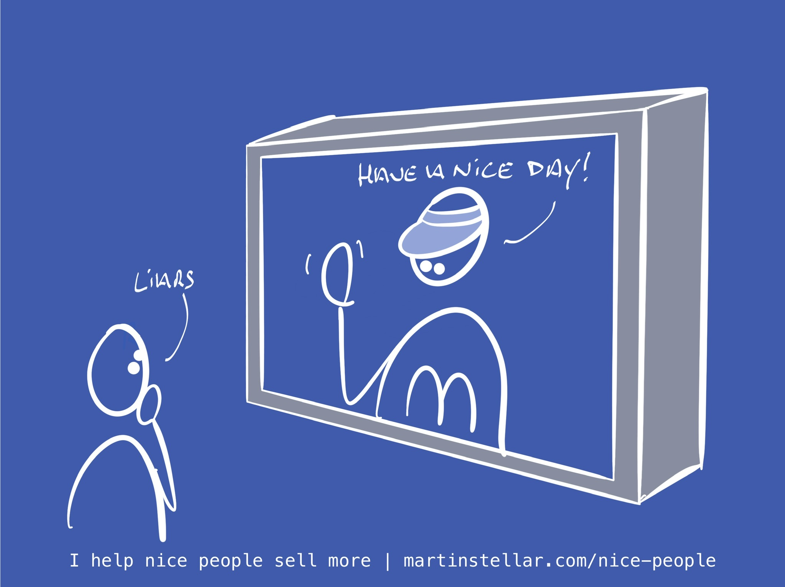

---
tags:
  - Articles
  - SalesForNicePeople
  - SFNP-book
pubDate: 2024-10-07
type: sfcContent
location: 
cdate: 2024-10-07 Mon
episode: 
imagePath: Media/SalesFlowCoach.app_How-MdDonalds-ruined-my-birthday_MartinStellar.jpeg
---

Three weeks ago I decided [to write a book](https://martinstellar.com/book), and it's only been 30 decades in the making. 
Yes indeed, after many hours of hard work, Sales for Nice People (the book!) is now live, and available wherever you like to buy your books. 
And I thought as a teaser, it might be nice to share the preamble. Here you go:

---
# How McDonalds ruined my birthday

The Netherlands, early 80s. 10-year old Martin picks up the TV guide from the doormat, and sits down to see what's going to be on, next week. 

There's Married With Children, Dr. Who (!), The Young Ones (!!), and a there's going to be a documentary about Jim Henson's *The Dark Crystal* (!!!)

He flips over to another page, and sees a full-page advert, with a date at the top, and the opening line:

### "Dear Friend"

Next to it, a photo of the director of the company, in full business suit, and at the bottom, in blue handwriting, his signature.

## Little Martin scans the page, reads the copy, and feels disgust, seeing the falseness of it all

The signature is made to look real, but it's just print. 

The 'dear friend header' goes out to millions of readers, and the whole story about the product on offer and its benefits is just hype and and buzz.

Later that day, a McDonalds advertisement ran on TV. 

Happy faces, super-friendly staff, kindness and joy, and a truly happy kid, delighting in his apple pie... 

It looked so lovely. "Make today a McDonalds day! 🎶"

So when my mother asked me a while later what I wanted to do for my upcoming birthday, I said: "I want to go to MacDonalds!"

Which is where we went... and where reality though proved very different from the ad.

### The light was harsh and bleak. The plastic chairs looked cheap. Not a smile in sight

The person attending us wasn't nice or fun at all.

There was no 'have a nice day'.

Don't you even ask about smiles.

The burger was what it was, which is saying a lot.

And the apple pie that had looked so succulent on our TV screen was too hot, and had too little taste. It left a metallic taste in my mouth, much like the taste left after reading Mr Director's 'Dear friend' letter.

Moments like these, where I experienced the deception in marketing, were formative. They caused me to build up a case against marketing and selling, making me vow to never ever participate in that kind of crap.

And yet, here we are, 40 years later:

I'm the owner of a small business, I do marketing and selling, and what's even more:

My entire business consists of teaching and coaching people on how to get better at marketing and selling.

### Truly, the great do fall. Right?

Well, not exactly.

It's not that I do this work *despite* having vowed to never stoop so low - it's *because* of those vows.

Consider the two examples: The editorial, and the TV ad. 

In the first, it was clear that someone was fabricating a convincing case. ]

There was a crude kind of openness about it - it was transparent, easy to see that even though it looked like an op-ed, it was actually just what we call content marketing these days.

But that McDonalds ad, that was different.

### The McDonalds ad made a promise, and then that promise was broken

I was promised that I'd be a happy kid in a lovely place eating delicious food, prepared and served by people who pretend to like me - and I got absolutely nothing of any of that.

Instead, I got my hopes up high for having a totally fun birthday, and what I got was brightly-lit metallic-y disappointment with too much salt in it.

And *that* - the deceit and misrepresentation in marketing, sales, business, and advertising, that's what my vows were against.

And unlike my monastic vows, they hold up to this day.

This is why I created sales for Nice People, it's why I'm writing this book, and it's why my mission and my business exist:

To show ethical entrepreneurs how you can have a thriving, lucrative, profitable business, that does something good for the world and that gives you a good life...

And without ever having to deceive or connive or cajole.

## You can build a wildly successful business, and not ever have to go against your values

In fact, if you know how to play the game of ethical business (and sales, and marketing, etc), then you get to be profitable not in spite your values.

## Instead, you  get to be profitable *because* of your values.

If you are an owner or a founder and you want your small business to thrive... but you refuse to sacrifice your values on the altar of growth:

I wrote this book for you.

Let's dive in.

---

Ready to dive in, and get the full Sales for Nice People system in 170 pages?
Then here you go: https://books2read.com/salesfornicepeople

Cheers, 

Martin

