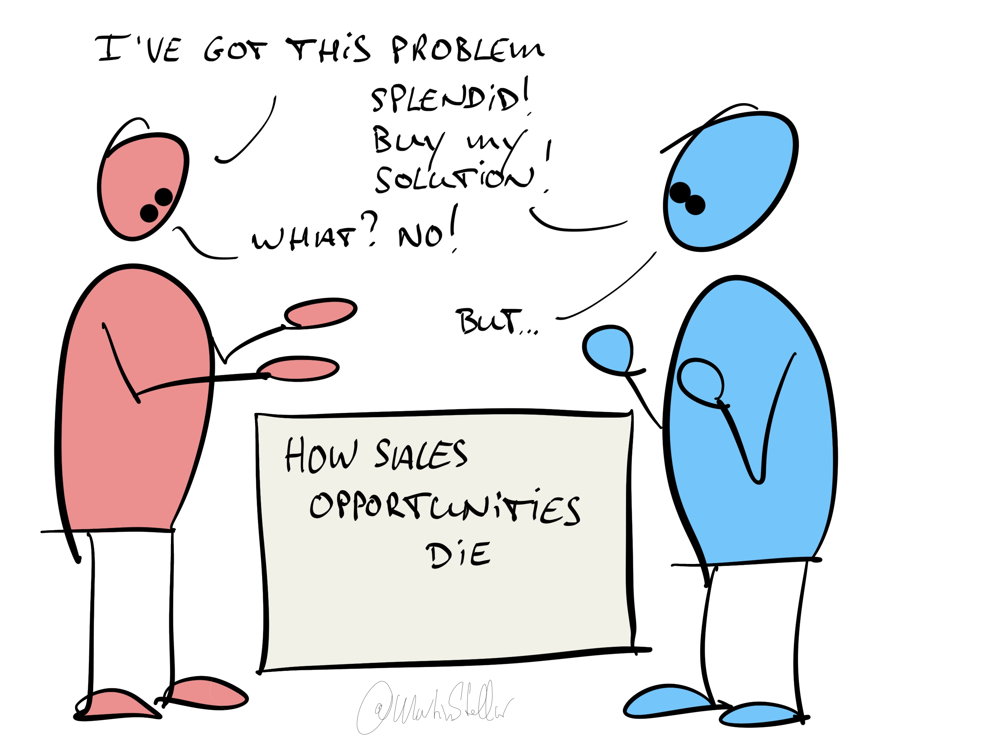

When you're looking at somebody's website, or when you're talking to a buyer, or an email comes in, or you're about to have a sales conversation…

How do you know that this is the right buyer for you, qualified and with budget, and with urgency, and enough trust to buy from you?

You might think that this is a perfect opportunity and that you can really help them.

Sure, maybe they have the problem that you are eminently equipped and qualified to solve - but that’s a story you’re telling yourself.

It’s assumptions that you are making, based on what you can infer and glean from their site and what they’ve told yo so far...

But this is just you computing data, in your own bubble, trying to tell yourself that you're the right fit and that you're the right solution for them.

And the data you have is always, without exception, going to be partial and incomplete.

So, how do you know whether or not you are the right fit?

You find that out by asking questions.

This is why it is so important that you frame all your sales interactions, your conversations, your email dialogues and everything, around exploring what actually they need, why they need it, how badly they need it, with what urgency, and so on.

Instead, what I see far too often, is people doing a variation on the following:

“Let's sit down and talk about buying my thing, because I’m an expert on this. I solve problems like these on a daily basis”.

But then the buyer person goes:

“Yeah, but wait a minute. I didn't tell you about any of the details, my concerns, the problems that I've had, the bad experience that I've had with your competitor in the past.

“You know nothing about me, and you're here to tell me that you should solve my problem, and I should buy your solution from you, and you’ve not even asked me any questions? I'm not buying any of this!”

That is how you turn a buyer away, just by saying:

“This is my thing, it’s what you need, you’d do well to buy it”.

Instead, let people tell you everything you need to know, so that you have sufficient data - actual intel - on whether or not someone is the right fit or not.

When you get to that stage, in many cases, the buyer enrolls themselves.

“When can we get started?” is the sweetest sentence when you’re dealing with a buyer.

And the best way to get to hearing those words?

[[🚀 What needs to happen?|Ask. More. Questions.]]
