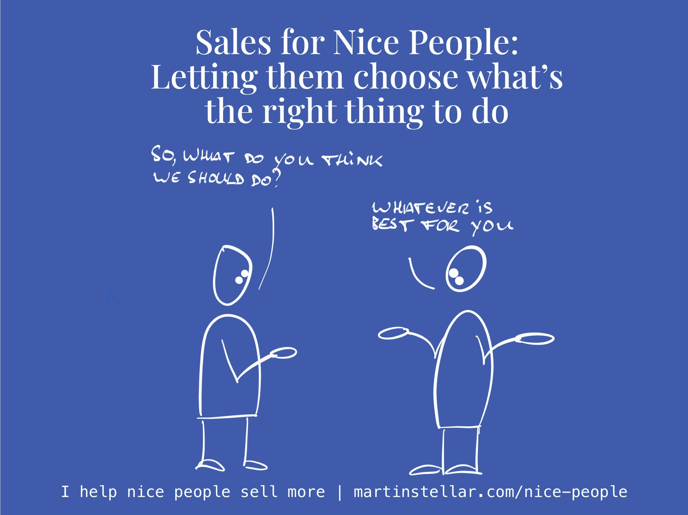

---
tags:
  - Articles
  - autonomy
  - SalesForNicePeople
pubDate: 2024-11-01
type: sfcContent
location: 
cdate: 2024-11-01 Fri
episode: 
imagePath: Media/SalesFlowCoach.app_Telling-people-what's-the-right-choice-vs-letting-them-choose_MartinStellar.jpeg
---

Of course, if you think that selling means you need to convince a buyer, then obviously it's going to feel awkward.

Because [[📄 Never convince, never persuade|convincing is code for 'telling people what's right for them']], and why would you want to do that?

It's not how nice people operate, and it's not effective anyway.

So instead of thinking of selling as telling people what's right for them, make it about them:

Selling means that you enable people to choose what's right for them.

That's helpful, it's a nice thing to do, and you get to feel great about engaging in a sales process with your buyers.
