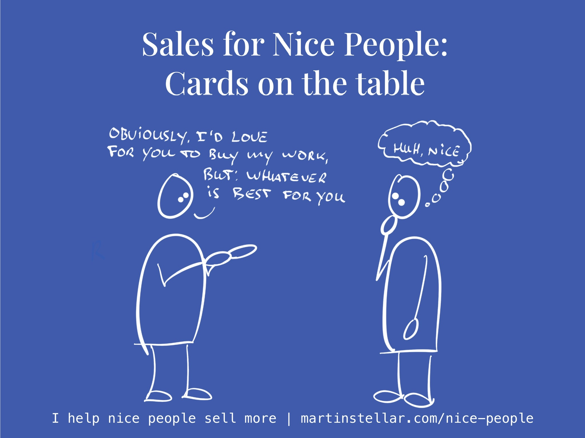

---
tags:
  - Articles
  - SalesConversations
  - SalesForNicePeople
pubDate: 2024-09-11
type: sfcContent
location: 
cdate: 2024-09-11 Wed
episode: 
imagePath: Media/SalesFlowCoach.app_How-to-take-the-awkwardness-out-of-the-sales-conversation_MartinStellar.jpeg
---

Yesterday during a Sales for Nice People training session, my student said he feels awkward about having meetings with buyers, because it always feels like it's about trying to get the sale, getting something from people. 
So here's how you flip that around and take the awkwardness out of it all, right at the start, by putting your cards on the table: 
> Hi there, I'm glad you're here.
Before we get started, I have a whole bunch of questions I need to ask you. 
And obviously, at the end I'd love for you to decide to work with me, but: 
I'm not here to get a sale.
Instead, my goal is to help you make the best possible decision, even if that is to not buy from me at this point. 
Does that sound fair?

What you're doing with that, is being open and honest about what you would like... but, you're doing it by placing your buyer's interests in front of your own. 
Because here's a company, a buyer with a problem, and maybe they want to buy your work... but by the same token, maybe they don't, or maybe not now. 
And by being upfront at the start and making it about their best interest, you give them a reason to trust you and open up about their challenges. 
The result? 
A conversation where you don't have to feel awkward, and where your buyer doesn't have to feel like they need to be cagey or guarded, which is often the case when they don't know you well enough yet. 
So if ever you feel awkward or conflicted about the sales conversation, start with the above script, and make things easier for you as well as your buyer. 
And if ever you want to actually get good at selling whilst staying completely true to your values, consider getting the 16-week one on one Sales for Nice People training. 
Next week there will be a price increase, so now is a good time to [get on board with the programme.](https://martinstellar.com/sales-for-nice-people-info/)