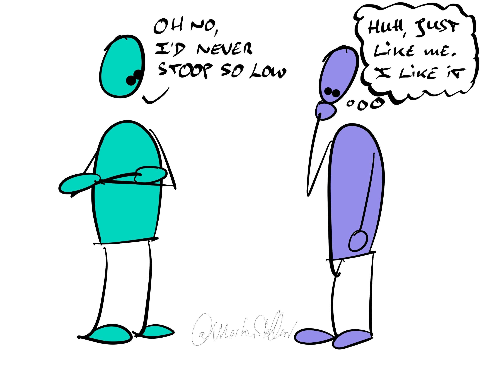

You'll have heard that when talking to a buyer, you should create rapport.

Most advice says that we're supposed to shoot the breeze for a bit, have some casual talk.

About the weather, the kids, a movie, or a sports game...

But I call that lame & perfunctory, and it's a waste of time as well.

Much better is to create rapport *before* you even talk to a buyer.

How?

Very simple: you lead with values, and you let those values guide you in terms of who you choose to talk to in the first place.

Because when two people care about the same thing, would defend the same thing, get upset about the same things that they believe should change, then you instantly have rapport.

Either implicitly or explicitly, before you even have your first conversation, rapport will be there.

It's really simple, too.

Take a sheet of paper, and write down at least 10 values that you have.

Next, rank them for priority, and identify the three main values, the top three that you'd never ever compromise.

Then, as you go through your prospecting and outreach and marketing and sales, you simply look for people who display similar, overlapping, or compatible values.

And you actively prioritise engaging with, and speaking to, those people.

Very simple - especially given the fact that people have their values always on display:

And it's easy to assess what values people hold dear - just spend a moment looking at someone's website or articles or social media presence, and you'll get a pretty good reading.

You'll be able to get an idea of what their values are - and when they match yours, they qualify for more of your time.

That's how you get off on the right foot, moving forward, efficiently and pleasantly, having rapport with every buyer you deal with.
