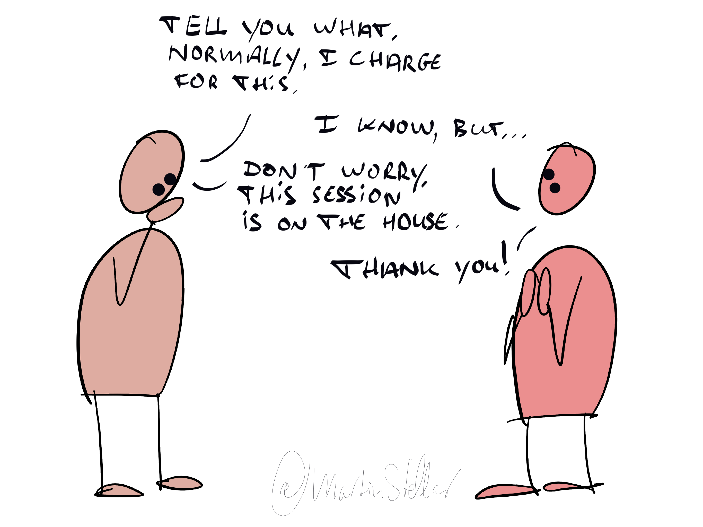

There’s a really dangerous trap that you can fall into, and it can be devastating to your business - in fact, it can literally take your business down.

It’s called ‘death by charity’, and it's extremely common, especially with integrous people - the kind of entrepreneur with values and ethics and a commitment do doing right by people.

You too might be at risk, especially if you’re a nice person and you want to help people, and being generous with your time is part of your sales strategy. Gotta be careful with that.

Because you either run a business, or a charity. Can’t have both, and you shouldn't [[📄 Don't subsidise your buyer's business|subsidise your buyer's business.]]

What you *can* have though, is the ability to be charitable and generous, when called for, when possible,*and provided you do it strategically*.

That’s called a being a good human being, and it’s also good marketing & sales.

Where most good-egg coaches and consultants get it wrong though, is making charity part of the branding and operations.

That's when coaches start giving away free sessions hoping it'll land them buyers.

Or when consultants have eleventy sales meetings with a buyer, until the buyer is so wisened up because of it all, they run off and go implement on their own.

Sure, when someone deserves it, and you believe in them, and they’re either a giver or a matcher? (see: Adam Grant, *Give and Take*), AND you have the financial stability and filled pipeline that enable you to give your scarce time away for free?

Then by all means, you can do things and give them for free, as a gift.

But be careful not to make free stuff the driver of your marketing, because death by charity is real.

And the better kind of person you are, the more you might be at risk.

All you need to do is make sure your buyer understands that you giving away time is generosity, with limited availability, and not a case of "take me for all I've got".

For instance, by simply saying at the start:

"That's a great challenge - that's exactly what people normally hire me for. But before we even get to that, why don't we have a look at the problem - I'll block out some time for it. No charge."

That way you're being helpful, and a good egg, and you're being strategic because you're framing the conversation and your time as a gift, and yourself as a professional.
