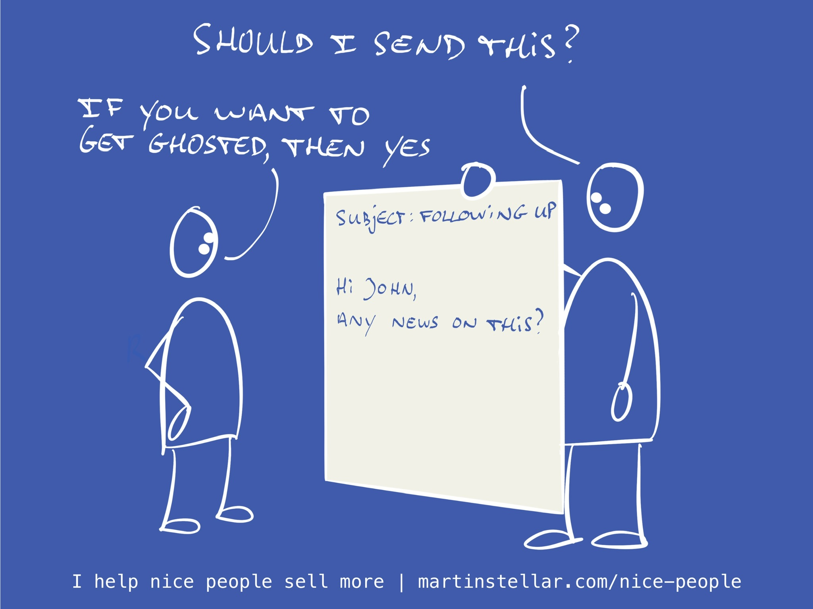

---
tags:
  - Articles
  - FollowUp
  - GettingGhosted
pubDate: 2024-11-14
type: sfcContent
location: 
cdate: 2024-11-14 Thu
episode: 
imagePath: Media/SalesFlowCoach.app_How-to-get-ghosted_MartinStellar.jpeg
---

There's two kinds of followup you can send, when you haven't heard from your buyer in a while.

One is where you clearly try to make the deal move forward.

It usually looks like "Any news on this?" or "Just following up on where we are at" or "Did you get a chance to review the proposal?"

On the surface, those might seem like useful messages, but you've probably noticed that[[📄 "How do I stop being ghosted?"| that kind of message either gets ignored]], or gets you replies like "No, no yet".

And then you have to follow up again, and you either get ignored again or get the same kind of reply. Which is how perfectly good deals die.

The other kind of followup is completely different. It doesn't try to move the deal forward, and it actually gets you replies.

Which is crucial, because when you get a reply it means the conversation continues, and a sale only happens in the context of a conversation.

And if the conversation stalls, so does your deal.

So the trick to sending followup that actually serves your deal as well as your buyer, is to send the kind of message that keeps the conversation going.

And for that, simply ask your buyer a question.

No, not questions that effectively say "Are you going to buy this thing yet?"

Instead, ask questions that are relevant, useful, and helpful.

For instance:

"If you were to postpone this project till next year, would that block you from launching your new product?"

Or:

"Since your team hasn't been able to make a decision on this yet, would it be helpful to meet and discuss a smaller kickoff project?"

Or:

"If I were to create a few slides for you to take into your next meeting, would that enable you to better position the project with your co-founders?"

Obviously, those kinds of followup are also in function of you getting the sale.

But because they are calibrated to where your buyer is at, and because they force them to think, and because they are designed to get a response, and because they're clearly not intended to get your buyer to sign on the dotted line, they're much more likely to keep the conversation going.

And in that conversation, you might end up with the sale. Which you won't when the conversation stalls.

So when you followup, don't just send a perfunctory, functiona,l salesy message. Send people questions, designed to get a response.

Want my personal help and support on a weekly basis, in figuring out exactly what to write to buyers, and what to ask them, and what to say during your sales conversations?

That's called sales coaching, and it's a component of the Sales for Nice People training.

For 16 weeks, we meet once a week for 45 minutes. 20 minutes to teach you the SFNP system, and 25 minutes to help you on your deals, your pricing, your followup and your sales.

At $3000 it's of course a considerable investment - but, it's a 1-on-1 programme, and the goal of the programme (not the guarantee, there's far too much that goes into the mix) is for you to recover your investment in extra sales and higher prices, long before the 16 weeks is up.

Anyway, Sales for Nice People is the ethical selling system for owners and founders who would love to sell more, and who want to learn how to do that by turning the sales process itself into an act of service.

[More info and registration here. ](https://martinstellar.com/sales-for-nice-people-info/)
