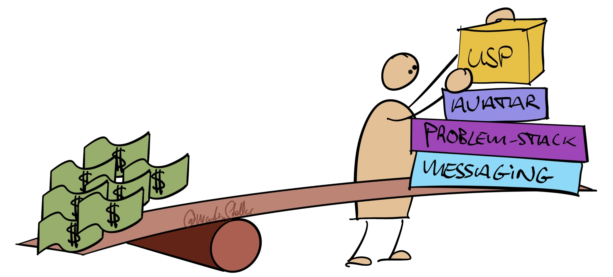

---
tags:
  - Articles
  - Hidden-Sales-Assets
  - BreakthroughSession
pubDate: 2024-08-05
type: sfcContent
location: 
cdate: 2024-04-15 Mon
imagePath: Media/SalesFlowCoach.app_How-to-massively-boost-your-sales_MartinStellar.jpeg
episode: "26"
podStatus: Published
---
  

If you look back at your business' history, you'll find that you've spent years - maybe even decades - building up your assets, positioning, and relationships.

But if you then look at your Profit & Loss, you might find that the returns aren't really what you'd expect, after exerting yourself so much, for so long.

Today, I'm going to give you a way to change that.

I'm going to share with you a very simple, psychology-based method, for generating more leads, more sales and more revenue, from everything that you've put in over the years.

Yes, this is the Hidden Sales Assets methodology I developed, and while the mini-training is still under construction, I do have a micro-training for you (i.e. a checklist PDF) that you can download for free.

And I believe you should, and I also believe that you should reserve time to read it, study it, and analyse your database of past and current clients, with the questions you find in the checklist.

Because after many, many years in business, and 30+ years of studying psychology and human behaviour, and gathering insights from some of the smartest people in business, Hidden Sales Assets is an extremely effective, people-centered, empathy-based approach, to - as Jay Abraham says it - get all that you can, out of everything that you've got.

And what have you got?

A career spent investing time, mental resources and money, into a marketing and sales process.

And all that investment can be made to work for you, if only you take the time to really understand your clients. Understand them so well, that you know exactly who should buy from you, for which reasons, and what you need to say to them in order to make that happen.

In other words: Hidden Sales Assets teaches you a step-by-step, analytical approach, to getting ultra-clear on how to bring your offer to market, and how to turn contacts into sales.

If you're frustrated that all your efforts haven't brought you more results yet, this checklist will help you get those results.

Download it, print it, scribble on it... and then get your client list out, and get studious on those people. You'll be pleasantly surprised - maybe even amazed - by how much value and sales and money is accessible to you.

Here's the download - [the Hidden Sales Assets Checklist. ](https://martinstellar.com/hsa)

And let me know if you have any questions...

Cheers,

Martin

P.s. For entrepreneurs who want more sales and revenue now, and who don't want to take the time to do the homework: I've kinda done that homework for you. In that: after many years of talking to entrepreneurs and analysing marketing and sales opportunities, I can run you through the process in 60 minutes, and you'll be equipped and ready to go out and have far more sales conversations, of far better quality, and get new sales, and more sales than you would have thought possible.

visibiltTl;dr: If you're in a rush and want to boost your pipeline now, [go here.](https://martinstellar.com/salesbreakthroughsession)
