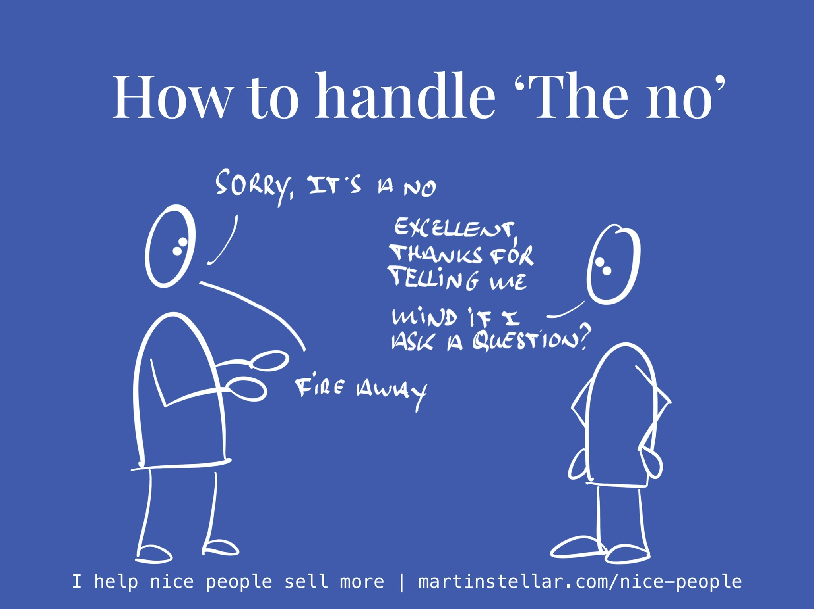

---
tags:
  - Articles
pubDate: 2024-07-26
type: sfcContent
location: 
cdate: 2024-07-25 Thu
episode: 
imagePath: Media/SalesFlowcoach.app_How-to-handle-the-no_MartinStellar.jpeg
podStatus: Published
---

There's many different ways you could react when a buyer tells you no.

Of course there's the bitterly cynical "Well FU then", and I don't think you or anyone out there would say that (though you might be surprised that there are actual professional sales people who talk like that behind closed doors while crying into their Martinis, but I digress).

A far more common - and you might do this as well - reaction, is to go "Well ok, I understand. Let me know if you need any help in the future", and leave it at that.

And that's respectful enough, but it's not helpful, not for you or for your buyer.

Obviously, you're not going to go and 'make your buyer wrong' - you don't go "Yes but...", because that isn't going to get you any result.

But, if you're able to continue the conversation instead of letting it die, you might learn something. Or, you might end up with an introduction, or permission to followup, or in some cases, you might actually end up with a sale.

So here's how a handy outline, for how you might reply, the way I like to do it.

Buyer says "Thanks, but we've decided not to go ahead".

Me: "Perfect, thank you. I'm glad you were able to make a decision.

"Obviously I was hoping for a different decision, but I'd rather have a no, instead of no decision at all.

Mind if I ask you a question?"

Done this way, your buyer is faced with a completely unexpected reaction - a pattern interrupt, because the most expected reaction is either "Yes but" or "Okay let me know if you need anything in the future".

Except in this case, they're being thanked, and you're 'making them right', as well.

Because of that, you'l be able to start a new conversation, away from the deal they turned down.

And you start that new conversation, by asking permission to ask a question.

And then you ask more of the relevant, clarity-creating questions that students learn in Sales for Nice People.

For instance:

"If price weren't the issue, would this have been a yes?"

"Can you tell me in what way this offer didn't meet your goals or needs?"

"What would be a different, better way for me to serve you?"

"Just so that I understand: is there anything that I've missed, in getting us to this point?"

What all these questions have in common, is that they're not about closing the deal. Because if you reply to no by asking questions intended to lead the deal forward, you're just wasting time cuz it ain't going to happen.

Instead all these questions are intended to help you understand more about your buyer, and if you've made your sales process about understanding your buyer, it'll be completely natural to them to continue the conversation in a similar vein.

And then you learn, you gather intel, and you just might find a thread to pull on, another line of conversation, where you end up with another opportunity.

Will it close the sale you lost? Probably not.

Will it get you something you'd never get if you just walk away? Pretty much guaranteed.
