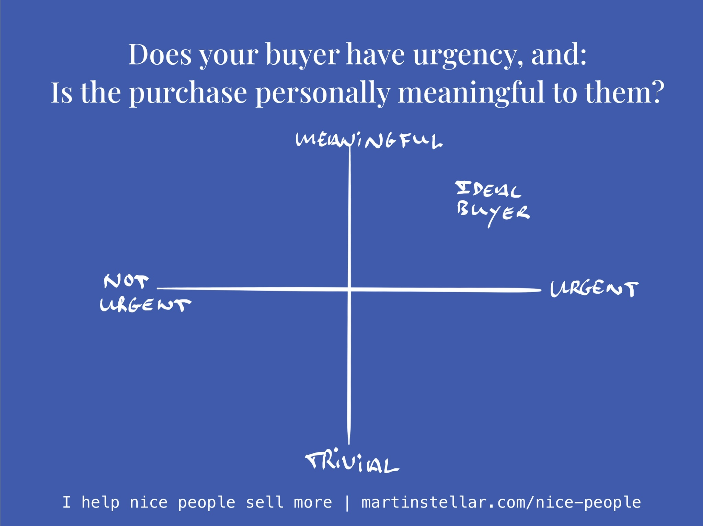

---
tags:
  - Articles
  - Lenses
  - Hidden-Sales-Assets
  - BreakthroughSession
pubDate: 2024-12-27
type: sfcContent
cdate: 2024-04-24 Wed
imagePath: Media/SalesFlowCoach.app_Focus-questions-for-lowering-your-CAC_MartinStellar.jpeg
episode: "27"
docStatus: ""
podStatus: Published
seo1: "\"The default when trying to land more clients is to go for volume. More outreach, more calls, more marketing, more advertising. And yes, that might well work. But, it also means you're increasing your cost of acquisition. And don't that just suck, because now you're spending more time and more money and all else being the same, you're probably not making that much more of a profit. Put differently: mo' money, mo' problems. So instead, why not just convert more of your buyers into clients? Here's some thoughts on why and how to make that happen, in whichever format your prefer. \""
---

For every buyer who becomes a client, there's a price to pay:

Whether it's the ads you run, your content strategy, having sales conversations or putting things on a billboard:

People usually don't just show up, turn themselves into clients and give you money - you first need to spend time, and money, in order to create those clients.

And as you'll have noticed, it can take a lot of time, and a lot of money, to land new clients.

But there's a very simple razor you can use - or a *lens*, as I like to call it - to lower that cost, instantly and dramatically.

See there's people who need your solution, but it's a someday-thing. They like what you do, they're keen, but they're just not in a rush.

Others have a now-problem and they want a now-solution. Obviously those are more likely to buy, and sooner, so it makes sense to spend your time engaging with those people, and attracting those kinds of people, with whatever means of marketing you use.

But then there's another aspect to consider: [[👤 What change in identity will take place when they buy?|the identity-piece]].

It's that grossly overlooked psychological component of buying solutions, related to how an individual stands to win and how they see themselves, once they hire you.

That founder who buys your costly and comprehensive marketing programme, designed to get them to profitability in the next 6 months?

If she decides to buy that programme from you, she's doing that because at the end of 6 months, her identity - her self-view - will have been upgraded tremendously:

Her investors, her children, her spouse, her employees, the other moms she hangs out with:

Everyone will admire her for her accomplishments. "You're SO smart - that decision to buy that marketing implementation was the best thing you could have done!".

Yes indeed, it was. And while the numbers in a spreadsheet and in a proposal do a great job of providing logical reasons and motivators (i.e. rationalisation), it's ultimately the desire to upgrade herself (which happens once those numbers ultimately show up in the spreadsheet) that ultimately drives the purchase. 

Now it might seem like a purchase of that type is a lot more meaningful than, say, buying a box of routers* - but make no mistake: straightforward technical solutions are usually not trivial at all either. 

There's just the fact that buyers of commodities often aren't aware of how meaningful a purchase could be, which puts the onus on you to make them aware (see the footnote).

Anyway: Your most likely future clients are those who have an urgent need, and for whom buying from you represents something meaningful, on a personal level.

So if you want to optimise your efforts and investing in your business, and lower the cost of landing new clients:

Focus on those people for whom buying from you relates to a personal win and identity upgrade. 

Engage with those people, market to them, and avoid spending your scarce time on anyone else. 

Those who have a someday-problem either won't solve it, or they'll do so once it becomes a now-problem, in which case they'll have become a candidate to engage with - and those who don't personally transform when buying, well they are much less likely to buy, than those will step into a new identity when they buy and get your solution. 

Now, the above is a terrific reason to get yourself a Hidden Sales Assets Breakthrough Session, because:

I've spent decades studying people, buyer-psychology, motivators, fears and aspirations, which means I can ask you very specific questions about your business and clients, and translate your answers into insights, strategy and messaging, meaning that you will know exactly who to focus on, and how to communicate with them in a way that gets them over the line.

Because that's how you lower the cost of acquiring clients: Focus on the right people (and ignore everyone else), and tell them exactly what they need to hear. 

After such a Breakthrough Session, people tend to walk away feeling like this:

![[SalesFlowCoach.app_Testimonial-Matthew_MartinStellar.png]]

I'll just leave that here, along with the link where you can get yourself some of that:

https://martinstellar.com/salesbreakthroughsession/

Cheers,

Martin

\* So, what **if** your business consists of selling software, or some other technical or functional solution, like boxes of routers, or web hosting, or car repairs?

Then you are even more encouraged to get a session, because what you sell might be hardware, but what your client buys might be 'the final end to our multi-year network issues at the office', and you bet being the guy or gal who bought a solution to that gets your buyer a sweet 'n big identity-upgrade. 

And helping you figure out that kind of motivator, and the messaging that goes along with it, that's my wheelhouse and my happy place. 

And **you** will be far more likely to end up in that happy place called 'sold another box of routers'.

[Link is here.](https://martinstellar.com/salesbreakthroughsession/)
