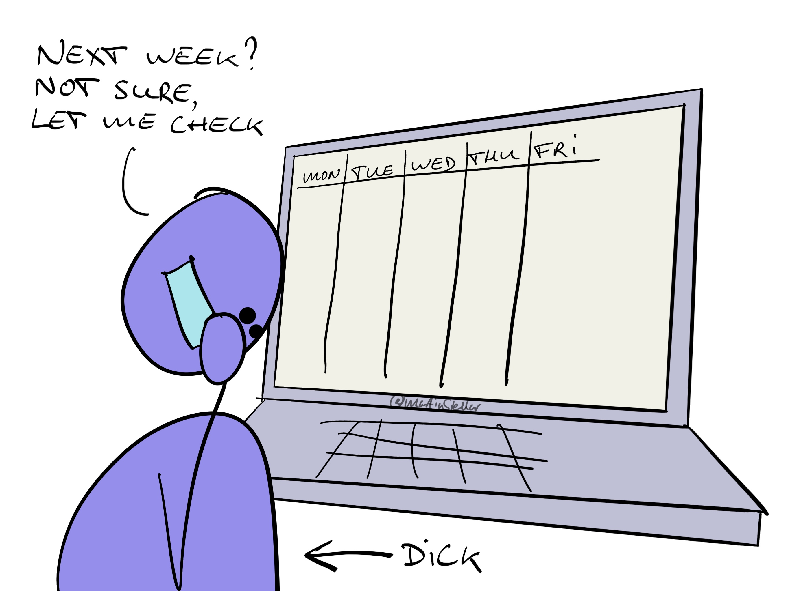

---
tags:
  - Articles
  - Ethics
  - Truthfulness
pubDate: 2024-03-31
type: sfcContent
location: Malaga
cdate: 2024-03-22 Fri
imagePath: Media/SalesFlowCoach.app_How-to-lie-to-your-buyers-and-be-a-dick-like-all-those-salespeople-out-there_MartinStellar.jpg
---

Look, I'm not talking about **all** salespeople out there. Just the ones that lie to their buyers.

"Hi! I had an appointment in your neighbourhood and thought I'd drop by. Is this a good time?"

No you didn't, you drove out to the neighbourhood, specifically so you could say that.

"I have an appointment at the top of the hour, so it'll only take 30 minutes".

No, you don't have an appointment. You're only saying that because you want your buyer to agree to seeing you, and get them to do so by letting them know you won't eat up their morning.

"Next week? I'll need to check my calendar, because I have quite a few meetings".

No, you don't need to check, because you know full well that your calendar is a barren desert of no meetings whatsoever, next week and the weeks after.

Whether you call these fibs, or white lies, or necessary evil:

If truthfulness and integrity are part of your values, you don't say things like that.

But then you get the sales gurus - even those who otherwise preach integrous practices and dealings - teaching you to tell untruths.

"Oh but it's not a lie!", they'll even say. "Sure you drove out to that neighbourhood for the express purpose of seeing that buyer, but you can't say that, can you? Besides, how else are you going to make sure you get that meeting?"

I'll tell you how:

By standing for something, playing from your strengths.

Because if you can't make a meeting or a sale happen without being 100% truthful, you either lack knowledge & skills, or you're being weak (or worse).

A strong person gets their way, and their sales, without having to stoop to scuzzy tactics, half-truths and un-truths.

If you don't think that last part matters, or that it's ok to fib, then I can't help you, and you're welcome to jump off this list.

But if you know that you can sell more if you upgrade the first part - your skills and knowledge - then I can.

This is how:

Once a week, for 16 weeks straight, I'll give you a live, 1 on 1 training session, teaching you an ethical selling approach that is 100% integrous, feels wonderful, is loved by your buyers, and gets you sales.

The calls last 60 minutes, with the first 20 minutes for training, and the remainder is where I'll coach you on your lead generation and your deals, helping you move each of them forward.

You also get direct and ongoing access to me by text, 5 days a week, so that we can keep the conversation going and keep you working on advancing and closing your sales.

That programme is the Sales for Nice People training, and you can get it for $3000.

If you're ready to jump in, or you have questions, [book a call to talk](https://calendly.com/martinstellar/30-minute-appointment-with-martin-stellar) through the details and what to expect.

Otherwise, if you want more information, [go here:](https://martinstellar.com/leap-ethical-selling-framework/))
