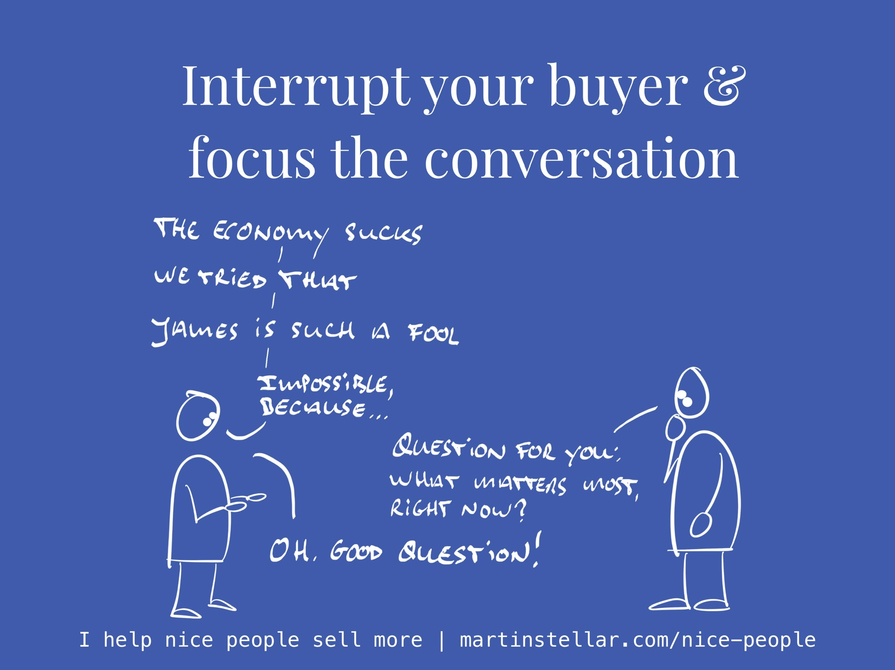

<iframe width="100%" height="180" frameborder="no" scrolling="no" seamless="" src="https://share.transistor.fm/e/b2991b5e"></iframe>

Wait, what? You should constantly, repeatedly... interrupt your buyer?

Well, depending on the situation and the conversation: yes, sometimes you should.

When a buyer engages with you, they have a problem and they're trying to figure out whether or not to solve it, and whether or not it should be solved by you.

And that means you get to serve them in creating the clarity they need, in order to get to a decision.

It makes you [[📄 Sell Stewardship|the steward]] over the conversation, their outcome, and their decision.

And that means it's your job - respectfully, and effectively - to guide the conversation.

Because if you don't, and you let your buyer take the lead, who knows where you'll end up?

We've all been in conversations where the other person went off on a tangent, rambling about something sideways related, or complaining about how James at HR always throws a spanner in the works when there's a new initiative.

Sure, that information might be relevant, but does it enhance and advance the conversation?

If you let your buyer moan on and on about problems, does that help them get clarity? Does it help at all, in any way?

Life is short, and so is your opportunity to speak with a buyer and provide a relevant, helpful conversation.

So, when you notice your buyer is drifting away from the topic of 'whether or not to solve this problem we have', interrupt them.

But, not by interjecting your thoughts or ideas - that's rude and ineffective.

Instead, when you need to focus your conversation, ask sharp, short, pointy questions.

The kind of question that forces people to think, about that what matters most.

For instance:

- Since when?
- How did that differ from what you were expecting?
- What makes that important?
- What possible negatives could come with that?
- What if that were a feature, not a bug?
- Impossible, unless?
- What is the real issue here?
- What matters most, right now?

Questions like that, they're not perceived as rude, but helpful, because they trigger reflection.

Life is short, and so are your sales conversations.

Don't let people waste their time and yours by drifting off - ask questions, focus your buyer.
