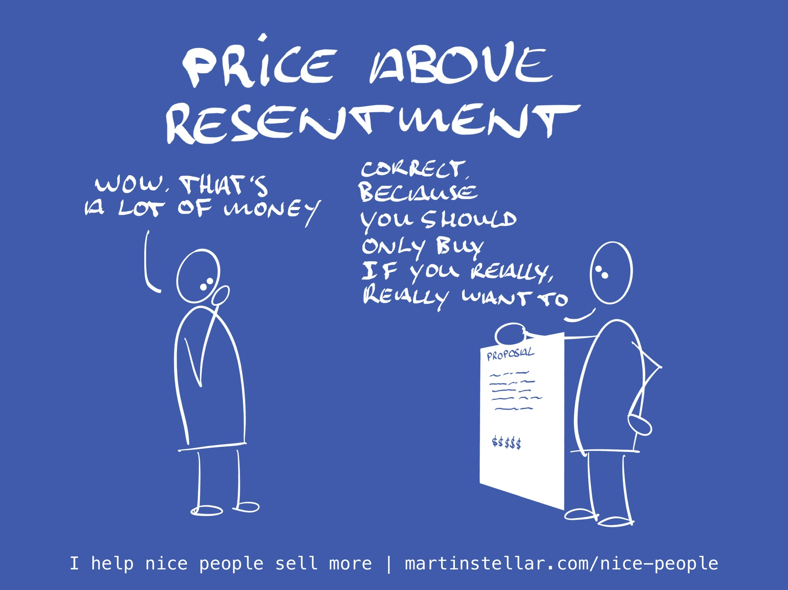

---
tags:
  - Articles
  - Pricing
  - Positioning
  - BeThePrize
pubDate: 2024-11-13
type: sfcContent
location: 
cdate: 2024-01-18 Thu
imagePath: Media/SalesFlowCoach.app_Price-above-resentment_MartinStellar.jpeg
docStatus: 
---

Ever had one of those client projects where everything is going well, and you like the gig... but at some point, you start feeling resentful?

It's not that there's scope-creep necessarily, and what they're asking isn't unreasonable, and they're being respectful and all, but... 

Given what your client has paid you, you really shouldn't be doing all the extra stuff, you know? If only you'd charged more, then you'd have been happy to deliver add-ons, and overdeliver.

But you didn't, and now you frown and feel annoyed and resentful, each time there's another email coming in or they're asking for another revision.

The solution is to 'price above resentment'.

Meaning, you quote a fee that is so high, it doesn't matter what your client asks - you're happy to do it.

For instance, a while ago I had to go Edinburgh for a number of on-premise, multi-hour sessions with a client. 

But that type of deliverable was not part of the deal, when we made and agreement and they decided to buy a coaching programme. Instead, the programme was to be conducted on Zoom, an hour a week, with extra hour-long calls as needed and upon request.

And yet, when they asked me to fly out on a week's notice, I instantly booked a flight, because they'd paid my fee without haggling, and that fee was 'priced above resentment'.

So when they had a clear and pressing need for an extra, on-site multi-hour intervention, I was happy to deliver that. 

But if I'd have given them a 'reasonable' price, or if I'd made it 'affordable', then I'd have flown out grudgingly, instead of happily.

But my pricing was high enough for me to deliver whatever extras they need, and so there I was in freezing Scotland. No resentment.

Of course it's a ballsy move, to quote high fees and stick to them.

But consider: suppose somebody would say "Hey Martin, we need you full-time, for a year, in Stockholm. How much?"

Well, the answer would be simple: I don't want to live in the North, and I don't want to be full-time for a client, so the price would be half a million dollars, paid in advance. Which obviously nobody would ever pay.

But if it happens that someone is crazy enough to fork over half a million? Well ok, then maybe I'd do it - and if I would, at such a rate, I'd feel no resentment whatsoever. Obviously.

When you price above resentment, a number of things happen:

You'll be able to overdeliver to staggering degrees, and also:

Very importantly, you enable your buyer to turn the buy/don't buy question into a much higher-quality decision.

Buy a website for $5000? Yeah okay, maybe. Sure let's do it.

Buy the same website for $20K? Okay, now we have a real important and weighty decision to make, guys. Do we need it this badly, is it truly that important?

Enabling that level of decision-making is in itself an act of service, because it forces your buyer to think longer and harder about the outcome they're buying and whether or not this is the right decision, and whether or not they want to [[📄 When price is your buyer's objection, give the 'put up or pay up message'|keep paying for the problem or pay for the solution instead]].

Oh, and fun fact: in many cases, you quoting a price that you're certain they won't pay, is often met with a straight-up "Sounds good, let's do it."

Proof: while in Scotland I had dinner with a friend, to whom I had explained the concept of pricing above resentment the month before.

He had a new buyer show up, he wanted the gig but he wasn't sure, so he quoted a price above resentment, much higher than he thought he could get for it, and and yes: the buyer replied "Sounds good, let's do it".

Put very simply: When you make things affordable, you sell a commodity. 

But when you price above resentment, what you sell is a must-have - but only for those who must have it. And, selling at properly high price-points enables you to provide whatever your client needs, and you'll never have to feel resentful when they ask for extras or more. 

This kind of thinking, and much more profitable thinking like it, is what you get in the [Sales for Nice People training](https://martinstellar.com/sales-for-nice-people-info/), and I highly recommend you check it out.