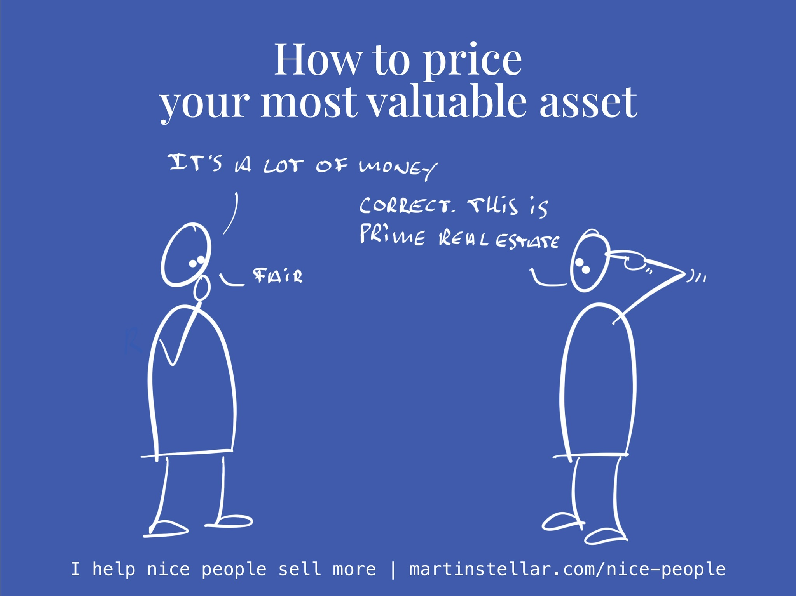

---
tags:
  - Articles
  - Pricing
  - MentalRealEstate
  - KnowledgeWork
pubDate: 2024-08-28
type: sfcContent
location: 
cdate: 2024-08-28 Wed
episode: 
imagePath: Media/SalesFlowCoach.app_Mental-real-estate-and-how-to-price-your-work_MartinStellar.jpeg
---

If you are a coach or consultant, if you provide high-level business services, then you are what some people call a 'knowledge worker'.

And that means that your most valuable asset, the thing that produces most results and value for your clients, is your mind.

It's where you've loaded all your knowledge, stored your experience, and it's where you do all the high-value thinking and computing, that enables you to create and provide solutions that your clients benefit from.

Put differently: your mind is a kind of real estate, and the better you are at your work, the more valuable that real estate is.

That mind of yours, that's the thing where you do your magic.

And when you as a coach or consultant work with a client on a long-term complex challenge, that means you'll have tenants:

People, and their problems, living in your mind - for three months, a year, three years...

And when you have those tenants, occupying space, someone's gotta pay rent - and that someone is not you.

But here is where most coaches and consultants go wrong:
- 
The longer a project lasts, the lower the per-hour rate they put on it.

So a 1-hour consultation might cost $400, but a three-month engagement with weekly coaching sessions is priced at $4000, instead of $4800. Because hey, that's fair, isn't it?

Yes it might be fair to your buyer, but it's not fair to you, or to your past self.

Your past self has spent decades 'doing up the place', turning that mind of you into prime real estate.

And the longer and more intensive a client engagement, the cheaper occupancy gets? No fair.

And it's not just about duration and intensity: the next thing to consider is that the more involved and intense your work, i.e. the more mental real estate you allocate to your client, the higher the quality of your work.

This is why when someone wants 20 minutes of advice from me, I don't put a price on that. You can have it, for free, no worries.

Or when someone signs up for[ text-only coaching](https://personal.salesflowcoach.app/), it's only $99 per month, because for me to check in with questions and write a reply, that takes almost no mental real estate at all. And once I hit send, my client is no longer present in my mind, until they send the next message. Same thing with spot coaching: Client calls me, we talk for 15 minutes, and I move on with my day. I.e. I have a 'mental guest' for 15 minutes, but no tenant throughout the engagement.

But when someone wants me to spend 3 months in a virtually unlimited coaching relationship, where I'm available 7 days a week, for as many sessions as they need, and on-site visits or full-day sessions are included?

Then that client is one of my few full-occupancy tenants, and yes, that means it costs $25K to have me that involved, that intensely, for three months. Like I said: I've spent decades redecorating the place, my mind is prime real estate, and if someone wants to live there, there's rent to pay. 

Of course this article will likely have people unsubscribe from my list, because "outrageous!", but before you hit that unsub link, ask yourself:

In how you price your work... how well do you get compensated for all the skills and learnings you've amassed, how valuable is your mental real estate... and do you charge your 'tenants' what that real estate is actually worth?
