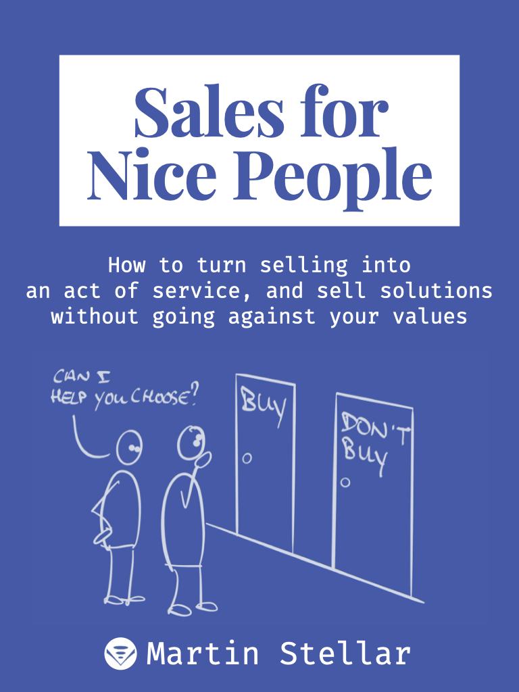

---
tags:
  - Articles
pubDate: 2024-09-20
type: sfcContent
location: 
cdate: 2024-09-20 Fri
episode: 
imagePath: Media/SalesFlowCoach.app_Sales-for-nice-people-book_MartinStellar.jpeg
---

It's not necessarily that a buyer wants to blow you off - everybody has a life to live and things to attend to - but very often when a buyer says "Can you send me some information?", you saying "Sure" could mean you lose the deal and the opportunity to help them.

Because how do you know what to send, what's going to be useful and relevant?

Sure, you can send an article, a brochure or a pricing page, but why would that be the thing they want to receive?

You can't know, so whenever a buyer asks for some info, ask them a question:

"Happy to, for sure. Before I do that, what specifically would you like me to send? What would be most helpful?"

Now your buyer is telling you what they want to know, and why it will be relevant for them, and that means two things:

You'll be sending what they asked for, and they'll make an implicit commitment to at least look at what you're sending.

"Sure, I'll send you something" is people-pleasing, and that doesn't serve your buyer.

But "Sure, tell me what to send and what you want to get out of it?" is an act of service.

Which, you know, is exactly what Sales for Nice People is about.

On that note: the Sales for Nice People book is coming along nicely and should be out early next week.

You can sign up for the launch list [here](https://martinstellar.com/book)

Cheers,

Martin

P.s. The 16-week Sales for Nice People training is going up in price by $100/day until it reaches 3K, so [consider getting the programme](https://martinstellar.com/sales-for-nice-people-info/) at today's $1990.
