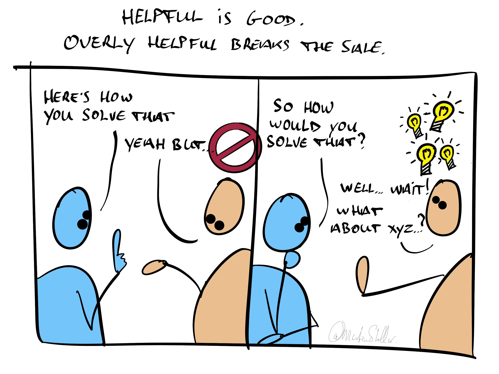

Wait, what?

Isn’t being helpful when selling the thing that Martin always teaches?

Yes indeed - but if you get it wrong, you ruin the sale instead of winning it.

Meaning: If you go and proffer your help all the time, you’ll quickly find that the more you volunteer your good advice and good ideas, the more you’ll meet with resistance. (Also know as *psychological reactance*, and [[📄 How to Make a Buyer Wrong, and Lose the Sale|here are some useful questions to avoid causing that]])

Being too helpful gets you the opposite result of what you want.

This is a particularly hard nut to crack for coaches and consultants.

After all, we want to help. That’s why people hire us - because we help with stuff.

We help problems go away, we help stabilise things, grow things, fix things…

And, yes: helpfulness in selling underpins my entire selling methodology.

And yet... Here’s a fine example of helping done wrong:

A while ago I was teaching someone how to sew trousers (I used to be a tailor, I enjoy teaching, they asked for help).

And she was being all kinds of helpful: Do I want some tea, do I have enough light, let me fold that fabric for you Martin… it was nice - really nice when a student does their best to make a teacher's life easier.

But, she was too helpful. Far too helpful.

Each time I would reach for my shears, or a ruler, or a piece of chalk, it would be gone because she’d helpfully moved it out of the way for me.

In the end, it happened so often that I had to fight my urges and not let my built-up annoyance and frustration shine through. After all, she was only trying to help.

And that right there, that attitude of 'only trying to help', is what you as a seller need to be extremely careful with.

Why?

Because when you’re "only trying to help", guess what happens?

You’re making it about you. You go out offering your help and ideas, foisting them on the other, because it's you who has this "great idea I really need you to see and adopt!".

'Only trying to help' is about you - but a buyer wants the conversation and the promised outcome, and the purchase, to be about them.

So, [[📄 Good ideas? Volunteer nothing|stop having good ideas for people]].

Because when a buyer explains a problem or a struggle, and the coach or consultant goes:

“Oh I can totally help with that, you should XYZ and then it goes away!”, your wanting to be helpful means you're telling the other person what to do, and nobody likes that.

And, compounded negative effect:

You remove from the buyer the process of reaching an insight, which is exactly what they need in order to accept, and own, the idea or suggestion or offer that you want to provide them with.

So, don't *sell* anyone an idea or a product or a solution: *just help them buy it*.
