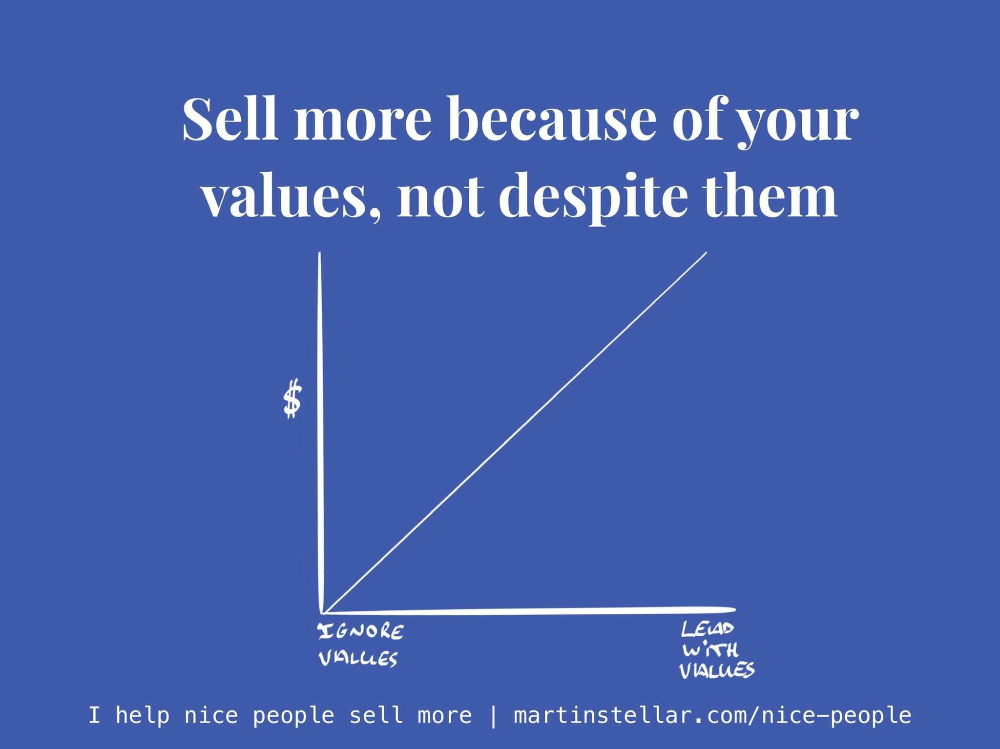

---
tags:
  - Articles
  - Values
  - Good-eggProblem
pubDate: 2025-01-02
type: sfcContent
location: 
cdate: 2024-07-04 Thu
episode: 4
imagePath: Media/SalesFlowCoach.app_Sell-more-because-of-your-values-not-despite-them_MartinStellar.jpeg
podStatus: Published

---

A student of my Sales for Nice People programme commented on the podcast I launched in 2024 (available in [audio](https://sales-for-nice-people.transistor.fm/) version as well as [video](https://www.youtube.com/playlist?list=PLVS4MQCwJlbyFLRdx-QmswD0t4pIZ88DO)):

"I really like what you say at the start, about how you teach people how to sell more because of their values, not despite them".

But he also mentioned that while for him it makes sense, since he's been through the training, not everyone might get what I mean by that.

So here's the deal:

People with high integrity, entrepreneurs who live and work by their values, are often the ones who most struggle to get their work sold.

Because you don't want to be pushy, you don't want to be salesy, or greedy, you don't want to bother people, and you certainly don't want to be scuzzy or manipulative.

In other words: your values come first, and they are not negotiable.

Well done, you're officially a person of integrity, and I can get you the badge.

But. If you're like that, you might be living with what I call the 'good-egg problem'.

Meaning: because your values matter so much, you actually make it less likely that people will say yes and give you money.

Your values become the reason you don't sell more, because while you do want to sell more, you don't want to sell more **despite your values**. You don't want to compromise on them.

This is why Sales for Nice People exists, and why I write every day and publish podcast episodes (currently on a break, will restart soon):

To show good-egg entrepreneurs that you can sell more, and earn more, without ever having to compromise on your values.

So then how does that work - **how do you sell more because of your values?**

The answer is surprisingly simple:

You lead with values. You let them be your compass, you build them into your USP, you demonstrate them implicitly or explicitly, and, very importantly:

You seek to appeal to, and engage with, only those buyers who have values in common with you.

Do that, and you'll instantly see selling get easier, and more fun. **You'l sell more and earn more, because of your values, not despite them**

But that's still fairly academic.

So if you want to sell more and earn more, and you want the practical, hands-on, do-this-and-say-that instructions on how to enroll more buyers, Sales for Nice People teaches you exactly that, in a 16-week 1 on 1 training programme.

Some of the things you'll learn:

- How to have sales conversations your buyers love and want more of
- Why asking questions takes the pressure off and gives you the intel you need to keep your deals moving forward
- Why you should avoid confirmation bias and how to make sure you truly understand your buyer
- How to create empathy and epiphany in your buyer
- Why hyping up your offer is the worst thing you can do, and what to do instead
- How to confidently, comfortably, ask for the sale
- Why you should filter leads based on values and create instant rapport without having to talk about the weather or yesterday's game ("Hey, what about those Lakers!" Blegh.)
- How to measure the quality of your sales conversations by the answers your buyer gives you
- How to not look needy, but 'be the prize', instead
- Why you sell more when you 'hand people their autonomy'
- How to give people the right to veto and have them become even more keen on getting your solution
- Why demographics are nowhere near as important as psychographics, and:
- Why you should prioritise buyers based on psychological markers
- How to make sales something you do **with** your buyer, not **to** your buyer
- How and why to ask buyers to tell you 'no'
- How to never again try and 'close a deal', but instead invite people in to buy from you
- How to let the buyer enroll themselves, no pushing or forcing required
- How to stop selling time and sell the value instead
- How to price your work way higher than you thought possible, and feel terrific about it too
- How to not worry about 'selling', but just make it easy for people to say yes and buy from you

And those are just a few snippets.

The full programme goes deep into the psychology of selling, it's fully based on integrity and empathy and ethics, and, well, it works.

> Martin has helped our company to completely change our perspective on “sales”.  [...] We now find ourselves far more energized and ready, to create those connections and those sales.
> 
> ~ Nick Geoghegan, Strategy Director @ eatbigfish

> I believed that effective selling was an affront to my values and in direct contradiction to my personality. I couldn’t sell without selling my soul.
>
> Martin has changed all that. [...] I now have a platform for enjoyable, mutually beneficial conversations with potential clients.
> 
> ~ Phil Adams, I Know Some People Ltd.

> The value you get from working with Martin is beyond what I can put in words.
>
> Before, our monthly sales were weak and fluctuating. After, within weeks, we achieved stable six-figure annualized income, plus a waitlist, with no stress and no hard-sell tactics. Now, we are working on how to handle excess business!
> 
> ~ Mehmet Baytaş, Studio M.A. Baytaş

> Martin's SFNP sales training is fantastic.
> It transformed how I approach my whole sales process as a coach and consultant with my Family Business clients, meaning very complex sales have become easier for me to handle.
>
> I fully endorse Martin's sales programme for anyone serious about investing in winning more clients.
> 
> ~ Mairi Mickel, Family Business consultant

So if you want some of that, here's where [you can go to get access.](https://martinstellar.com/sales-for-nice-people-info/)