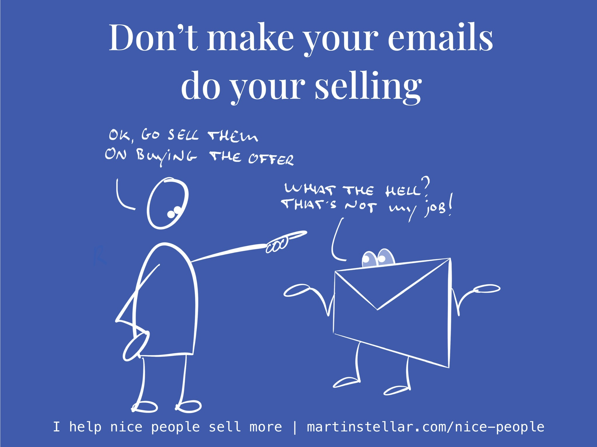

Email is a powerful tool, but only if you use it right.

And what most people get wrong, is trying to make an email message do the heavy lifting.

Meaning: my clients and students often try and sell a buyer on an offer or product, or on having a meeting.

Which then inevitably leads to emails going out with far too much content, far too many ideas, far too many notion in there.

And yes, it makes sense to try and get your buyer interested in what you do. After all that's how you generate sales.

Except email is the wrong vehicle for that.

Consider what email is and always has been for: communication.

And what's the worst thing that can happen in a sales process, or indeed in any kind of communication?

For that communication to end.

After all, how are you going to keep a conversation going, if you don't get a reply?

When you send your buyer an email, [[📄 "How do I stop being ghosted?"|and they don't reply, then what do you do]]?

Then you either forget about the opportunity, or you start sending followup.

In the first case, nothing will happen and in the second case, most of the time, nothing will also happen.

Which is a terrible way to waste resources, because getting a buyer to engage with you has a direct hard cost, in terms of marketing and business development and networking and what have you.

And each time a buyer interacts and then ghosts you, you're looking at lost ROI.

So to make your sales process and your emails more effective, go back to first principles, and consider what email is actually for:

Having a conversation, a dialogue, communication.

In other words: use your emails as a way to get a reply from people.

Because so long as your buyer replies, your conversation is ongoing and your opportunity is still alive.

Whereas if you don't get a reply, your opportunity might or might not be dead, and you have no way of knowing, because you're not getting a reply.

Very simply:

The wrong way to send use emails is trying to make a case and get people to buy in to your idea.

The right way to se use email is getting your buyer to reply.

And the best way to get a reply?

Make your buyer think - not about whether or not to buy your offer, but make them think about the problem they have, the cost of keeping the problem, and whether or not and what would change in their life and their identity, were they so to solve the problem.

That way, you're far more likely to get replies, you get to keep the conversation going, and asking for a meeting will be a logical, relevant, and often welcome extension, of the conversation you're having.

This - asking questions that make your buyer think - is at the very heart of Sales for Nice People, and it's why asking questions is one of the most important modes of conversation you can engage in with your buyers.

So, here's a question for you: is a few hours of reading worth it, in order for you as a nice person to have an easier time engaging in your sales process?

If the answer is yes, [the reading you're looking for is here.](https://books2read.com/salesfornicepeople)