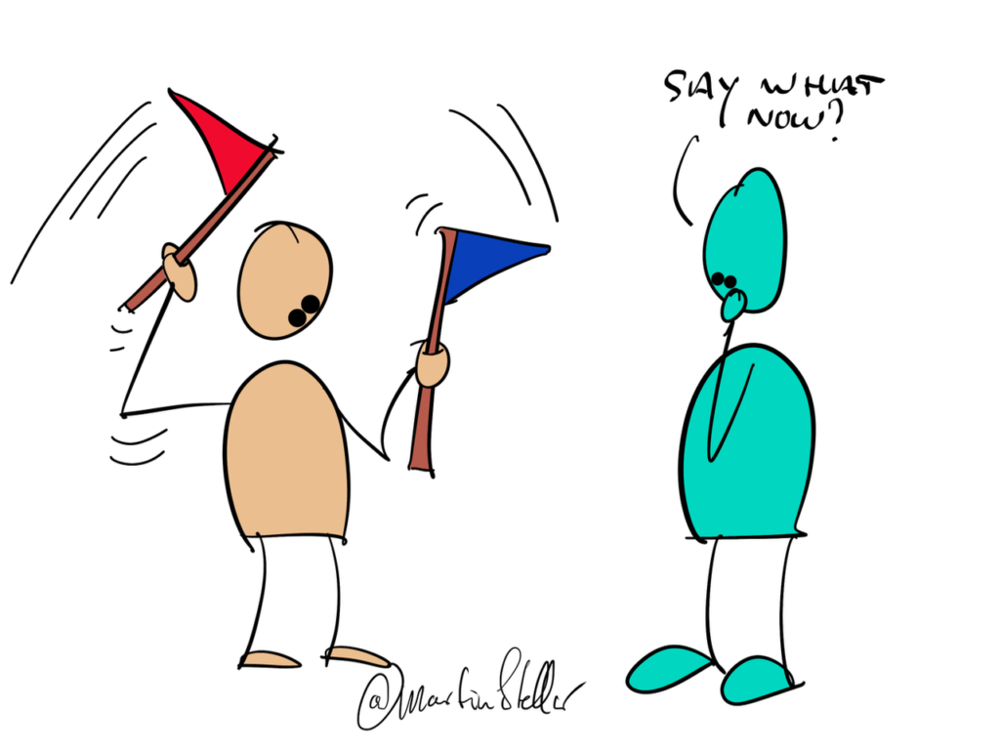

Human interaction is a game of signals, and therefore so is selling.

Everything we do or say - or indeed, don’t do or say - gives others a signal.

Expert communicators (for instance negotiators, therapists or coaches) tend to be pretty good at correctly interpreting signals.

That's the result of years of training, study and practice, but:

Here's a little tip that can instantly, dramatically, improve your communication skills, by installing 'doubt-bias'.

Meaning: Whatever you think the other person meant, you doubt the veracity of what you're thinking.

You call your assessment into question, and by default, ask yourself if you actually got it right, instead of simply believing that what you *think* they are saying, is actually what they *intend* for you to hear.

Because more often than not, we make interpretations and inferences based on confirmation bias, and we misread the message.

But by calling your interpretations into question, you stay open-minded to the message and signal that people are *actually* trying to send.

This matters a lot in the context of selling your work.

Because we all live with confirmation bias.

And all too often, that causes us to interpret signals that the other person is *interested*, as a signal that they are *committed*.

Clearly, obviously, those two are not the same.

And if you interpret an interest-signal (the buyer is interested in your solution, in the sales conversation, in how you work your magic) as a commitment-signal, you’ll react in a way that makes them tune out or back off.

They're signalling "Interesting, tell me more" and your reaction signals "Great, let's proceed to checkout!"

A fine way to break the sale.

Selling effectively really comes down to nothing more than correctly reading signals, and responding to the signals people *intended* to give, instead of the ones you *think* they gave - or, the ones you want them to give.

As long as a buyer stays interested, and you don’t misinterpret that as commitment, the conversation will continue, and they’ll get more and more ready to commit, all by themselves.

That’s how you [[📄 Any leads in your pipeline?|sell your work ethically]], in a way the buyer enjoys, and even thanks you for.
