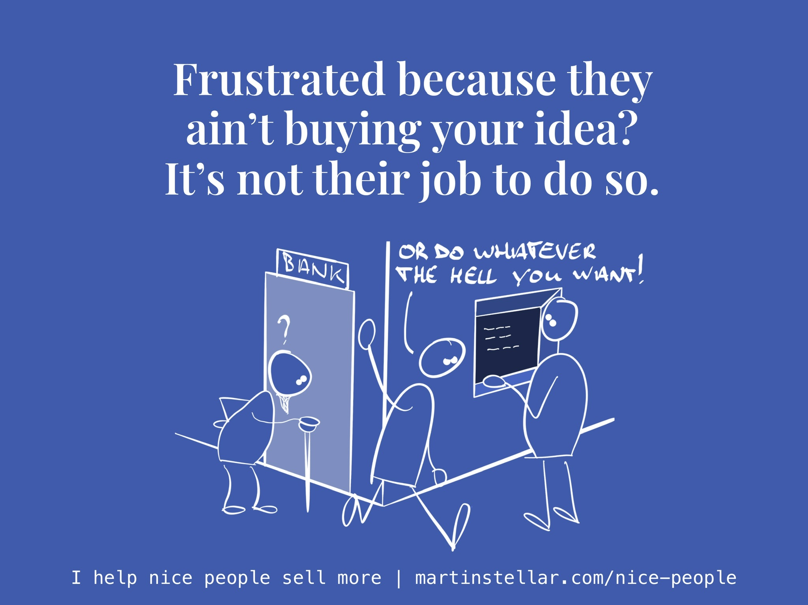

I park my bike and walk up to the cash machine.

At the door of the bank, two Spanish men: a son my age, and his ageing father.

“Dad, you don’t need to go in here every day.

“I can access your account from my computer, no problem.

“Really, there’s no need. If you want, I can print out a bank statement each day for you”.

The father stands there, quiet. It’s not clear if he understands what his son is telling him.

So far, it’s sounded friendly enough - but suddenly, the son gets impatient, and says:

“Or do whatever the hell you want to!” and storms off. (what he actually said in Spanish sounds a lot more blunt).

As I withdraw my cash, I wonder:

Is the father losing his marbles a bit, unable to understand what's going on?

Or is he untrusting of online banking?

Maybe he doesn't trust his son?

Or maybe, has modern life overtaken his level of comfort with processes and procedures and online and digital - and he just really wants a face at a bank telling him his account status?

There’s no telling, but one thing is certain:

His son was trying to sell him that there's no need to go in every day, and dad wasn't buying it.

Also certain: It’s not the father’s job to understand, or to trust, or to accept, or indeed to buy in.

Instead, it’s the son’s job to find the message that will finally have his father see that showing up live at the bank daily really isn’t necessary.

But, he didn't realise that, tried to persuade and reason and convince, and failed and got frustrated. Obviously. 

Now, if ever you get frustrated when someone doesn’t buy your offer, or doesn't buy in to the good idea you’re trying to to get across, remember this:

It’s not the other person’s job to do buy your stuff. 

Instead, it’s your job to reach that other person, and see if you can help them want what you have for them, and you do that by putting yourself in their shoes.

It’s in <em>their</em> world that the sale happens - not in yours.

So if they’re not buying, it’s your job to keep the conversation going.

And asking questions will get you much further than pushing your agenda, no matter how valid your agenda may be.

Of course it's easy to be an armchair expert, and opine that the son could have gotten through by asking questions, and I don't know the backstory.

But I do know that persuading and convincing is never as effective as asking questions.

So here's a question for you:

Is it worth 10 x 40 minutes to you, and a one-off payment of $1500, to learn how to *sell more because of your values, not despite them*... and earn more, and very probably even get you to enjoy the process, if not outright making it fun? If I can get you that, would you consider investing 1500 bucks and ten weeks of personal 1 on 1 training? 

I'm not asking for you to buy here - I'm asking if you'd be open to considering it.

Because given that it's done wondrously helpful things for many people, such as Mairi Mickel, and Phil Adams, both of Edinburgh, and I've got the testimonials to prove it, and if you're a good egg and you want more sales and money, it could work for you as well. 

Would you consider it?

If you would, you can go here for more information, to [help you in your considering and deciding. ](https://martinstellar.com/sales-for-nice-people-info/)

